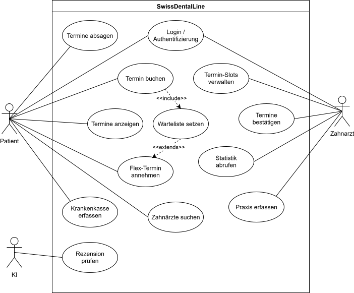
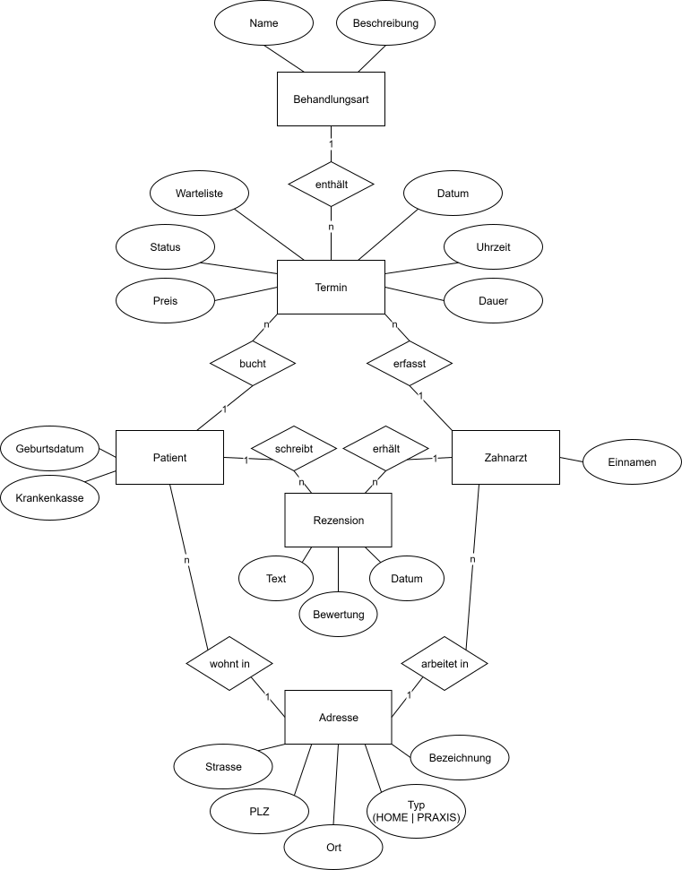

# SwissDentalLine

SwissDentalLine ist eine webbasierte Plattform für die digitale Terminverwaltung zwischen Patienten und Zahnärzten in der Schweiz.
Ziele sind effiziente Terminbuchung, Verwaltung von Praxis-Slots, KI-geprüfte Rezensionen und Minimierung von Leerlaufzeiten über Wartelisten & Flex-Termine.

# Inhaltsverzeichnis
- [Einleitung](#einleitung)
    - [Explore-Board](#explore-board)
    - [Create-Board](#create-board)
    - [Evaluate-Board](#evaluate-board)
    - [Diskussion Feedback Pitch](#diskussion-feedback-pitch)
- [Anforderungen](#anforderungen)
    - [Use-Case Diagramm](#use-case-diagramm)
    - [Use-Case Beschreibung](#use-case-beschreibung)
    - [Fachliches Datenmodell](#fachliches-datenmodell)
    - [UI-Mockup](#ui-mockup)
- [Implementation](#implementation)
    - [Frontend](#frontend)
    - [KI-Funktionen](#ki-funktionen)
	- [Drittsysteme](#drittsysteme)
- [Fazit](#fazit)
    - [Stand der Implementation](#stand-der-implementation)
    
# Einleitung

## Explore-Board

### TRENDS und  TECHNOLOGIE
- Zunehmende Digitalisierung im Gesundheitswesen (E-Health, Telemedizin)  
- Megatrend: Self-Service im Gesundheitsbereich  
- Auth0 für sichere Benutzerverwaltung und rollenbasierte Zugriffe  
- KI-Content-Moderation mit **Spring Boot AI** (ethische Textprüfung)  
- Cloud-Deployment (Azure, Docker, GitHub Actions)  
- Nutzung von MongoDB für flexible, dokumentbasierte Datenstrukturen  
- Fokus auf mobile Nutzung und  responsive Web-UIs  

---

### POTENZIELLE PARTNER und  WETTBEWERB
- **Zahnarztpraxen** – zur Verwendung der Terminverwaltungsplattform
- **Auth0** – sichere Authentifizierung und  Rollenverwaltung  
- **MongoDB Atlas** – skalierbare Cloud-Datenbank  
- **Spring Boot AI** – Integration von KI zur Textanalyse  
- **Krankenkassen und  zahnmedizinische Verbände** – für API-/Datenkooperation  
- Wettbewerber: **Doctolib**, **Zahnarztvergleich.ch**, **SwissSmile**  
  - Schwächen: begrenzte Filterfunktionen, keine direkte KI-Integration  

---

### FAKTEN
- Über 2.5 Millionen Zahnarzttermine pro Jahr in der Schweiz  
- Hoher Anteil an kurzfristigen Absagen und Leerzeiten (bis 20%)  
- Patienten erwarten sofortige Terminbestätigung und Transparenz  
- KI-basierte Filterung ethisch sensibler Rezensionen ist rechtlich relevant  

---

### USER
**Patienten**  
- wollen freie Zahnarzttermine einfach und schnell finden  
- möchten Krankenkasse und  Behandlungswünsche zentral verwalten  
- wünschen sich sichere Kommunikation und  transparente Bewertungen  
- möchten Termine flexibel verwalten zu können  

**Zahnärzte/Zahnärztinnen**  
- wollen Terminverwaltung und Patientenkommunikation vereinfachen  
- möchten Praxisauslastung steigern  
- benötigen Verwaltungsfunktionen und Umsatzstatistiken  

---

### POTENZIALFELDER
- Effiziente Auslastung der Zahnarztpraxen  
- Schnellere Terminbuchung durch digitale Transparenz  
- Vertrauensbildung durch geprüfte Rezensionen  
- Synergien mit Krankenkassen und  Praxissystemen
- Marktlücke sättigen  

---

### ERKENNTNISSE
- Patienten bevorzugen einfache Terminoberflächen 
- Praxen schätzen KI-basierte Tools, die Inhalte automatisch prüfen  
- Vertrauen entsteht durch echte, geprüfte Bewertungen  
- KI-Prüfung verbessert Qualität und Seriosität von Rezensionen  

---

### BEDÜRFNISSE
- Patienten: Zuverlässige Terminverfügbarkeit, transparente Kosten, Flexibilität  
- Zahnärzte: effiziente Verwaltung, weniger Leerzeiten, positive Reputation  

---

### TOUCHPOINTS
- Web-App (Desktop/Tablet optimiert)  
- Push-Benachrichtigungen  
- Praxis-Website-Integration  
- Auth0 Login und  personalisiertes Dashboard  

---

### WIE KÖNNEN WIR?
Wie können wir die Terminbuchung, die Wartelistenfunktionalität und Bewertung für Zahnärzte und Patienten so gestalten,
dass Vertrauen, Effizienz und ethische Standards gleichzeitig gewährleistet sind?

---

## Create-Board

### IDEEN-BESCHREIBUNG
SwissDentalLine verbindet Patienten und Zahnarztpraxen über eine intuitive Terminplattform,  
die freie Slots, Preise und Behandlungsarten anzeigt.
Durch die Warteliste- und Flex-Termin-Funktion können Leerzeiten flexibel genutzt werden. Diese Flexibilität ermöglicht es, Terminlücken in Echtzeit zu füllen und sorgt für eine gleichmässige Auslastung der Zahnarztpraxen.
Eine KI prüft automatisch Patientenbewertungen auf ethische und  moralische Verstösse vor Veröffentlichung.

---

### ADRESSIERTE NUTZER
- Patienten (Terminbuchung, Bewertung)  
- Zahnärzte (Praxisverwaltung, Statistik)  

---

### ADRESSIERTE BEDÜRFNISSE
- Transparente und flexible Terminverwaltung 
- Sicherheit und Vertrauen durch KI-geprüfte Rezensionen  
- Effizienzsteigerung in Praxen  

---

### PROBLEME
- Hoher Verwaltungsaufwand der Termin-Slots für Praxen 
- Mangelndes Vertrauen durch unmoderierte Bewertungen  

---

### IDEENPOTENZIAL
**Mehrwert:** 🔵🔵🔵🔵🔵🔵🔵🔵🔵⚪️ (9/10)  
**Übertragbarkeit:** 🔵🔵🔵🔵🔵🔵⚪️⚪️⚪️⚪️ (6/10)  
**Machbarkeit:** 🔵🔵🔵🔵🔵🔵🔵🔵⚪️⚪️ (8/10)

---

### DAS WOW
Die **Flex-Termin- und Wartelistenfunktion** ist das Herzstück von SwissDentalLine: Patienten können sich flexibel auf Wartelisten setzen lassen und werden automatisch informiert, sobald ein früherer Termin frei wird.
Zahnärzte profitieren gleichzeitig davon, dass kurzfristig abgesagte Termine sofort neu belegt werden können – ganz ohne zusätzlichen administrativen Aufwand.

So entsteht ein dynamischer Terminfluss, der Leerzeiten reduziert, die Auslastung der Praxis optimiert und Patienten schneller zu einem passenden Termin verhilft. Diese Flex-Planung ist in der Schweizer Zahnmedizin bislang nicht vorhanden und schafft einen echten Mehrwert für beide Seiten.

---

### HIGH-LEVEL-KONZEPT
„**Doctolib mit Flexibilität** – smarte Terminplattform mit Wartelisten- und Flex-Terminlogik.“

---

### WERTVERSPRECHEN
SwissDentalLine bietet Patienten schnelle, sichere und faire Terminbuchung  
und hilft Praxen, Auslastung und Reputation mit minimalem Aufwand zu steigern.

---

## Evaluate-Board

### KANÄLE
- Online-Marketing (SEO, Google Ads, Social Media)  
- Kooperationen mit Krankenkassen und  Praxen  
- Empfehlungsprogramm für Patienten  

---

### UNFAIRER VORTEIL
- Flex-Termin- und Wartelistenlogik: automatische Nachbesetzung freier Termine für maximale Auslastung
- KI-basierte Inhaltsmoderation (Spring Boot AI)  
- Integration mit Auth0 und MongoDB für sicheres Rollenmanagement  
- Kombination aus Buchung, Flexibilität, Bewertung und  Statistik in einer Plattform  

---

### KPI
- Anzahl gebuchter Termine pro Monat  
- Anteil der über Wartelisten vergebenen Flex-Termine
- Durchschnittliche Praxisauslastung (%)  
- Benutzeraktivität (aktive Patienten/Zahnärzte)  
- Reduktion von Leerzeiten (%)  
- KI-geprüfte Rezensionen (Anteil positiv/verworfen)  

---

### EINNAHMEQUELLEN
- Monatsabonnement für Zahnarztpraxen 
- Patienten nutzen die Plattform kostenlos  
- Optional: Kooperationen mit Krankenkassen zur Datensynchronisation und Terminempfehlungssystemen  

## Diskussion Feedback Pitch
> Diskussion des Feedbacks aus dem Pitch (bezogen auf Projektinhalt)

# Anforderungen

## Use-Case Diagramm

## Use-Case Beschreibung
> Hier die Use-Case Beschreibung einfügen so wie du das in RE gelernt hast. 

## Fachliches Datenmodell 

> Hier das fachliche Datenmodell (ER-Modell) einbinden und Zustände beschreiben. Ein fachliches Modell enthält **keine** IDs oder Ähnliches

## UI-Mockup 
> Mockup oder Skizze des UIs

# Implementation

## Frontend
> Beschreibung des Frontends mit Screenshots der fertigen Applikation. Alle Teile des GUIs, die bewertet werden sollen, müssen abgebildet sein.

## KI-Funktionen
> Aufgaben und Funktionen des eingebundenen KI-Modells.

## Optionale Anforderungen
> Liste der umgesetzten optionalen Anforderungen mit Beschreibung.

# Fazit

## Stand der Implementation
> Stand der Implementation, nächste Schritte (mit Referenz auf den Backlog).