# SwissDentalLine

## Überblick

**SwissDentalLine** ist eine vollständig digitale Plattform zur Optimierung der Terminverwaltung im schweizerischen Zahnarztwesen. Die Anwendung verbindet moderne Webtechnologien mit künstlicher Intelligenz, um sowohl Patienten als auch Zahnärzten eine effiziente, transparente und benutzerfreundliche Lösung für die Terminkoordination zu bieten.

Die zentrale Innovation von SwissDentalLine liegt im **dynamischen Wartelisten-Management**: Patienten können sich bei der Terminbuchung für frühere Zeitfenster vormerken lassen. Wird ein Termin abgesagt, erfolgt eine Nachbesetzung – Patienten erhalten umgehend eine Benachrichtigung und Zahnärzte können ihre Praxiskapazitäten optimal auslasten. Ergänzt wird dies durch eine **KI-gesteuerte Rezensionsmoderation**, die Patientenbewertungen vor der Veröffentlichung auf problematische Inhalte überprüft und so die Qualität und Seriosität der Plattform sicherstellt.

Die Architektur basiert auf etablierten Enterprise-Technologien: Das **Backend** nutzt Spring Boot 3.5.7 mit Java 21, MongoDB für die Datenpersistenz und Auth0 für sicheres Identity Management. Das **Frontend** wurde mit SvelteKit entwickelt und bietet eine responsive Benutzeroberfläche für alle Endgeräte. Die gesamte Infrastruktur ist containerisiert und wird über Azure App Service bereitgestellt, während GitHub Actions eine automatisierte CI/CD-Pipeline mit umfassenden Tests und Code-Qualitätsprüfungen gewährleistet.

**Zielgruppen**: Die Plattform adressiert zwei primäre Nutzergruppen mit unterschiedlichen Anforderungen – **Patienten**, die eine einfache Möglichkeit zur Terminfindung und -verwaltung suchen, sowie **Zahnärzte/Zahnärztinnen**, die ihre Praxisorganisation digitalisieren und Auslastungslücken minimieren möchten.

---

### Funktionsumfang nach Nutzerrolle

#### Patienten-Features:
- **Terminsuche mit Filteroptionen**: Gezielte Suche nach Behandlungsarten, Standorten, Zahnärzten und verfügbaren Zeitfenstern
- **Wartelisten-Funktion**: Automatische Benachrichtigung bei vorzeitig frei werdenden Terminen
- **Rezensionssystem**: Einsicht in geprüfte Bewertungen anderer Patienten für fundierte Zahnarzt-Auswahl
- **Terminhistorie**: Vollständige Übersicht über vergangene, aktuelle und geplante Behandlungen
- **Geräteübergreifende Nutzung**: Nahtlose Bedienung auf Desktop, Tablet und Smartphone

#### Zahnarzt-Features:
- **Analytik-Dashboard**: Echtzeit-Übersicht zu Terminauslastung, Umsatzentwicklung und Patientenfrequenz
- **Zeitslot-Verwaltung**: Flexible Konfiguration von Verfügbarkeiten, Behandlungsdauern und Preisen
- **Automatische Terminoptimierung**: Intelligente Nachbesetzung bei kurzfristigen Absagen durch Wartelisten-Mechanismus
- **Auswertungsfunktionen**: Detaillierte Statistiken zu Terminverteilung, Behandlungsarten und Zeiträumen
- **Reputationsmanagement**: Zugriff auf KI-moderierte Patientenfeedbacks und Bewertungen

# Inhaltsverzeichnis
- [Überblick](#überblick)
- [Einleitung](#einleitung)
    - [Explore-Board](#explore-board)
    - [Create-Board](#create-board)
    - [Evaluate-Board](#evaluate-board)
    - [Diskussion Feedback Pitch](#diskussion-feedback-pitch)
- [Anforderungen](#anforderungen)
    - [Use-Case Diagramm](#use-case-diagramm)
    - [Use-Case Beschreibung](#use-case-beschreibung)
    - [Fachliches Datenmodell](#fachliches-datenmodell)
    - [UI-Mockup](#ui-mockup)
- [Implementation](#implementation)
    - [Frontend](#frontend)
        - [Umsetzung & Technologie](#umsetzung--technologie)
        - [Testdaten (Rollen)](#testdaten-rollen)
        - [Screenshots (Global)](#screenshots-global)
        - [Screenshots (Patient)](#screenshots-patient)
        - [Screenshots (Zahnarzt)](#screenshots-zahnarzt)
    - [KI-Funktionen](#ki-funktionen)
        - [Einsatzbereich und Zweck](#einsatzbereich-und-zweck)
        - [Funktionsweise und Ablauf](#funktionsweise-und-ablauf)
- [Testing](#testing)
    - [Unit-Tests](#unit-tests)
    - [API-Tests (Postman)](#api-tests-postman)
    - [End-to-End Tests](#end-to-end-tests)
    - [SonarCloud Integration](#sonarcloud-integration)
- [Optionale Anforderungen](#optionale-anforderungen)
- [Out of Scope](#out-of-scope)
- [Fazit](#fazit)
    - [Stand der Implementation](#stand-der-implementation)
    
# Einleitung

## Explore-Board

### TRENDS und  TECHNOLOGIE
- Zunehmende Digitalisierung im Gesundheitswesen (E-Health, Telemedizin)  
- Megatrend: Self-Service im Gesundheitsbereich  
- Auth0 für sichere Benutzerverwaltung und rollenbasierte Zugriffe  
- KI-Content-Moderation (ethische Textprüfung)  
- Cloud-Deployment (Azure, Docker, GitHub Actions)  
- Nutzung von MongoDB für flexible, dokumentbasierte Datenstrukturen  
- Fokus auf mobile Nutzung und responsive Web-UIs  

---

### POTENZIELLE PARTNER und  WETTBEWERB
- **Zahnarztpraxen** – zur Verwendung der Terminverwaltungsplattform
- **Auth0** – sichere Authentifizierung und  Rollenverwaltung  
- **MongoDB Atlas** – skalierbare Cloud-Datenbank  
- **Spring Boot AI** – Integration von KI zur Textanalyse  
- **Krankenkassen und  zahnmedizinische Verbände** – für API-/Datenkooperation  
- Wettbewerber: **Doctolib**, **Zahnarztvergleich.ch**  
  - Schwächen: begrenzte Filterfunktionen, keine direkte KI-Integration  

---

### FAKTEN
- Über 2.5 Millionen Zahnarzttermine pro Jahr in der Schweiz  
- Hoher Anteil an kurzfristigen Absagen und Leerzeiten (bis 20%)  
- Patienten erwarten sofortige Terminbestätigung und Transparenz  
- KI-basierte Filterung ethisch sensibler Rezensionen ist rechtlich relevant  

---

### USER
**Patienten**  
- wollen freie Zahnarzttermine einfach und schnell finden  
- möchten Krankenkasse und  Behandlungswünsche zentral verwalten  
- wünschen sich sichere Kommunikation und  transparente Bewertungen  
- möchten Termine flexibel verwalten zu können  

**Zahnärzte/Zahnärztinnen**  
- wollen Terminverwaltung und Patientenkommunikation vereinfachen  
- möchten Praxisauslastung steigern  
- benötigen Verwaltungsfunktionen und Umsatzstatistiken  

---

### POTENZIALFELDER
- Effiziente Auslastung der Zahnarztpraxen  
- Schnellere Terminbuchung durch digitale Transparenz  
- Vertrauensbildung durch geprüfte Rezensionen  
- Synergien mit Krankenkassen und Praxissystemen
- Marktlücke sättigen  

---

### ERKENNTNISSE
- Patienten bevorzugen einfache Terminoberflächen 
- Praxen schätzen KI-basierte Tools, die Inhalte automatisch prüfen  
- Vertrauen entsteht durch echte, geprüfte Bewertungen  
- KI-Prüfung verbessert Qualität und Seriosität von Rezensionen  

---

### BEDÜRFNISSE
- Patienten: Zuverlässige Terminverfügbarkeit, transparente Kosten, Flexibilität  
- Zahnärzte: effiziente Verwaltung, weniger Leerzeiten, positive Reputation  

---

### TOUCHPOINTS
- Web-App (Desktop/Tablet optimiert)  
- Terminverwaltung in Echtzeit  
- Praxis-Website-Integration  
- Auth0 Login und  personalisiertes Dashboard  

---

### WIE KÖNNEN WIR?
Wie können wir die Terminbuchung, die Wartelistenfunktionalität und Bewertung für Zahnärzte und Patienten so gestalten,
dass Vertrauen, Effizienz und ethische Standards gleichzeitig gewährleistet sind?

---

## Create-Board

### IDEEN-BESCHREIBUNG
SwissDentalLine verbindet Patienten und Zahnarztpraxen über eine intuitive Terminplattform,  
die freie Slots, Preise und Behandlungsarten anzeigt.
Durch die Warteliste- und Flex-Termin-Funktion können Leerzeiten flexibel genutzt werden. Diese Flexibilität ermöglicht es, Terminlücken in Echtzeit zu füllen und sorgt für eine gleichmässige Auslastung der Zahnarztpraxen.
Eine KI prüft automatisch Patientenbewertungen auf ethische und  moralische Verstösse vor Veröffentlichung.

---

### ADRESSIERTE NUTZER
- Patienten (Terminbuchung, Bewertung)  
- Zahnärzte (Terminverwaltung, Praxisverwaltung, Statistik)  

---

### ADRESSIERTE BEDÜRFNISSE
- Transparente und flexible Terminverwaltung 
- Sicherheit und Vertrauen durch KI-geprüfte Rezensionen  
- Effizienzsteigerung in Praxen  

---

### PROBLEME
- Hoher Verwaltungsaufwand der Termin-Slots für Praxen 
- Mangelndes Vertrauen durch unmoderierte Bewertungen  

---

### IDEENPOTENZIAL
**Mehrwert:** 🔵🔵🔵🔵🔵🔵🔵🔵🔵⚪️ (9/10)  
**Übertragbarkeit:** 🔵🔵🔵🔵🔵🔵🔵⚪️⚪️⚪️ (7/10)  
**Machbarkeit:** 🔵🔵🔵🔵🔵🔵🔵🔵⚪️⚪️ (8/10)

---

### DAS WOW
Die **Flex-Termin- und Wartelistenfunktion** ist das Herzstück von SwissDentalLine: Patienten können sich flexibel auf Wartelisten setzen lassen und werden automatisch informiert, sobald ein früherer Termin frei wird.
Zahnärzte profitieren gleichzeitig davon, dass kurzfristig abgesagte Termine sofort neu belegt werden können – ganz ohne zusätzlichen administrativen Aufwand.

So entsteht ein dynamischer Terminfluss, der Leerzeiten reduziert, die Auslastung der Praxis optimiert und Patienten schneller zu einem passenden Termin verhilft. Diese Flex-Planung ist in der Schweizer Zahnmedizin bislang nicht vorhanden und schafft einen echten Mehrwert für beide Seiten.

---

### HIGH-LEVEL-KONZEPT
**Intelligente Zahnarzt-Terminplattform mit KI-gestützter Qualitätssicherung und dynamischem Wartelisten-Management zur Maximierung der Praxisauslastung.**

---

### WERTVERSPRECHEN
SwissDentalLine bietet Patienten schnelle, sichere und faire Terminbuchung  
und hilft Praxen, Auslastung und Reputation mit minimalem Aufwand zu steigern.

---

## Evaluate-Board

### KANÄLE
- Online-Marketing (SEO, Google Ads, Social Media)  
- Kooperationen mit Krankenkassen und Praxen  
- Empfehlungsprogramm für Patienten  

---

### UNFAIRER VORTEIL
- Flex-Termin- und Wartelistenlogik: automatische Nachbesetzung freier Termine für maximale Auslastung
- KI-basierte Inhaltsmoderation (Spring AI mit OpenAI)
- Auth0-Integration für enterprise-grade Sicherheit**
- Moderne Tech-Stack: Spring Boot 3.5, Java 21, MongoDB Atlas
- Integration mit Auth0 und MongoDB für sicheres Rollenmanagement
- Kombination aus Buchung, Flexibilität, Bewertung und Statistik in einer Plattform 

---

### KPI
- Anzahl gebuchter Termine pro Monat  
- Anteil der freigegebenen Flex-Termine
- Durchschnittliche Praxisauslastung (%)  
- Durchschnittliche Einnahmen der Zahnärzte (%)  
- Benutzeraktivität (aktive Patienten/Zahnärzte)  
- KI-geprüfte Rezensionen (Anteil positiv/verworfen)  

---

### EINNAHMEQUELLEN
- Monatsabonnement für Zahnarztpraxen oder Verkauf von Sofware-Lizenzen an Praxen
- Patienten nutzen die Plattform kostenlos  
- Optional: Kooperationen mit Krankenkassen zur Datensynchronisation und Terminempfehlungssystemen  

## Diskussion Feedback Pitch

Im Rahmen der Pitch-Präsentation erhielt SwissDentalLine wertvolles Feedback von Kommilitonen. Die Rückmeldungen zeigten sowohl die Stärken des Konzepts als auch wichtige Aspekte, die bei der Realisierung berücksichtigt werden müssen.

### Positive Resonanz und erkannte Stärken

**Relevanz der Problemstellung:**
Die zentrale Herausforderung – hohe Leerzeiten in Zahnarztpraxen durch kurzfristige Absagen – wurde als hochrelevant und praxisnah wahrgenommen. Die Kombination aus Patienten- und Zahnarzt-Perspektive überzeugte durch ihren Win-Win-Ansatz.

**Innovationskraft:**
Besonders hervorgehoben wurden das **dynamische Wartelisten-Management** als Differenzierungsmerkmale gegenüber bestehenden Lösungen wie Doctolib oder ZaWin. Die Flex-Termin-Funktion wurde als innovativer Ansatz zur Optimierung der Praxisauslastung gewürdigt.

**Skalierungspotenzial:**
Die Übertragbarkeit auf andere medizinische Fachrichtungen (Hausärzte, Augenärzte, Physiotherapie) wurde positiv hervorgehoben und als strategisches Wachstumspotenzial identifiziert.

---

### Kritische Fragen und Herausforderungen

#### 1. KI-Integration und Funktionsweise
**Frage:** "Wie genau kommt die KI zum Einsatz?"

**Antwort:** Die KI-Integration erfolgt über **Spring AI mit OpenAI GPT** und adressiert die automatische Moderation von Patientenrezensionen. Die KI analysiert Bewertungen vor der Veröffentlichung auf:
- Beleidigungen und diskriminierende Äußerungen
- Hassrede und bedrohliche Inhalte
- Spam und irrelevante Werbung

Das System gibt automatisch eine APPROVED/REJECTED-Entscheidung mit detaillierter Begründung zurück. Dies schützt Zahnärzte vor rufschädigenden Inhalten und sichert die Qualität der Plattform.

**Zukünftiges Potenzial:** Erweiterung um KI-gestützte Terminempfehlungen basierend auf Behandlungshistorie, Standort und Verfügbarkeit.

---

#### 2. Wartelisten-Mechanismus und Edge Cases
**Frage:** "Was passiert, wenn der Wartelisten-Patient ebenfalls absagt?"

**Antwort:** Das System implementiert eine **kaskadierte Benachrichtigungskette**: Bei Absage eines Termins werden alle Patienten auf der Warteliste benachrichtigt. Der erste Patient, der die Benachrichtigung bestätigt, erhält den Termin. Wenn dieser Patient den Flex-Termin ebenfalls absagt, kann der Zahnarzt diesen Termin erneut für weitere flexible Patienten freigeben.

---

#### 3. Variable Behandlungszeiten
**Frage:** "Unterschiedliche Patienten benötigen unterschiedlich lange Behandlungszeiten – wie wird das berücksichtigt?"

**Antwort:** Das Datenmodell berücksichtigt dies durch:
- **Flexible Slot-Konfiguration**: Zahnärzte können individuelle Zeitfenster pro Behandlungsart definieren. Im generellen wird eine durchschnittliche Behandlungszeit durch den Zahnarzt definiert. Braucht der Zahnarzt für einen Patienten länger als geplant, sollte er eine Pufferzeit zwischen seinen Slots definieren. 

---

#### 4. Nutzerengagement und Retention
**Frage:** "Patienten gehen nur 1-2x pro Jahr zum Zahnarzt – wie sorgt man für regelmäßige Nutzung?"

**Antwort:** Im MVP adressiert SwissDentalLine die niedrige Nutzungsfrequenz durch **Wartelisten-Benachrichtigungen** (kontinuierliche Touchpoints bei Flex-Terminen), ein **transparentes Bewertungssystem** (Mehrwert auch ausserhalb eigener Buchungen) und eine **Terminhistorie** im Dashboard. 

**Scale-Up-Potenzial:** Langfristig kann die Plattform zur **fachrichtungsübergreifenden Gesundheits-Terminlösung** erweitert werden: Integration weiterer Fachrichtungen (Hausärzte, Augenärzte, Physiotherapie), proaktive Gesundheits-Erinnerungen, Family-Accounts und Krankenkassen-Integration würden die Nutzungsfrequenz auf viel mehr Interaktionen pro Jahr erhöhen und SwissDentalLine zum zentralen Gesundheits-Hub transformieren.

---

#### 5. Datenschutz und Sicherheit
**Frage:** "Wie werden sensible Gesundheitsdaten geschützt?"

**Antwort:** 
- **Auth0-Integration** für sichere Authentifizierung und rollenbasierte Zugriffskontrolle
- **MongoDB Atlas** mit verschlüsselter Datenübertragung
- **DSGVO-Konformität**: Minimalprinzip bei Datenerfassung (keine medizinischen Details, nur Behandlungsarten)
- **Passwort-Verschlüsselung** über Auth0-Standards
- **Keine Speicherung von Krankenakten** (nur Terminmanagement, keine medizinischen Diagnosen)

**Compliance:** Das System speichert ausschließlich terminrelevante Daten und keine sensiblen Gesundheitsinformationen gemäß Art. 9 DSGVO.

---

#### 6. Integration mit bestehenden Praxis-Systemen
**Frage:** "Kann SwissDentalLine mit Zahnarzt-Software wie ZaWin verbunden werden?"

**Antwort:** 
**Aktueller Stand:** SwissDentalLine ist als eigenständige Plattform konzipiert. Zahnärzte pflegen ihre Verfügbarkeiten manuell über das Dashboard.

**Zukünftiges Potenzial:**
- **REST-API** für Dritt-Systeme (Import/Export von Terminverfügbarkeiten)
- **Webhook-Integration** zur automatischen Synchronisation mit Praxissoftware
- **iCal/CalDAV-Export** für Kalender-Integration
- **B2B-Partnerschaften** mit Anbietern wie ZaWin oder PEX für nahtlose Anbindung

Dies würde den administrativen Aufwand für Zahnärzte weiter reduzieren und die Akzeptanz erhöhen.

---

#### 7. Skalierung auf andere Fachrichtungen
**Frage:** "Könnte das System auch für Hausärzte, Augenärzte oder Physiotherapie genutzt werden?"

**Antwort:** **Absolut.** Die Architektur ist so konzipiert, dass sie mit minimalen Anpassungen auf andere medizinische Bereiche übertragbar ist:

**Technische Basis:**
- **Generische Datenmodelle** (`Termin`, `Behandlungsart`, `Adresse`) sind fachrichtungsunabhängig
- **Rollenbasiertes System** erlaubt unterschiedliche Provider-Typen

**Go-to-Market-Strategie für Skalierung:**
1. **Phase 1:** Fokus auf Zahnmedizin (Proof of Concept)
2. **Phase 2:** Expansion zu Hausärzten und Fachärzten mit ähnlichen Herausforderungen
3. **Phase 3:** Übergreifende-Lösung für Gesundheitsnetzwerke

---

#### 8. Differenzierung zur Konkurrenz
**Frage:** "Wie hebt sich SwissDentalLine von Doctolib und ZaWin ab?"

**Antwort:**
| Feature | SwissDentalLine | Doctolib | ZaWin |
|---------|----------------|----------|-------|
| Flex-Termin & Warteliste | ✅ | ❌ | ❌ |
| KI-Rezensionsmoderation | ✅ | ❌ | ❌ |
| Fokus auf Praxisauslastung | ✅ | ⚠️ Teilweise | ⚠️ Teilweise |
| Schweiz-spezifisch | ✅ | ❌ (Europa-weit) | ✅ |

**Unique Selling Propositions:**
- **Intelligente Leerzeiten-Optimierung** durch automatisches Wartelisten- und Flex-Termin-Funktionalität
- **Ethik-geprüfte Bewertungen** für vertrauenswürdige Reputation
- **Transparente Preisgestaltung** bereits bei der Terminsuche sichtbar

---

#### 9. Onboarding und Nutzerakquise
**Frage:** "Wie gestaltet sich das Onboarding für Patienten und Zahnärzte?"

**Antwort:**
**Patienten-Onboarding:**
1. **Auth0-Login** (E-Mail oder Social-Login)
2. **Profil-Setup** (Name, Krankenkasse, Standort – optional)
3. **Guided Tour** durch Hauptfunktionen (Terminsuche, Warteliste)
4. **Erste Terminbuchung** als Onboarding-Abschluss

**Zahnarzt-Onboarding:**
1. **Zahnarzt-Registrierung** mit verifizierten Geschäftlichen E-Mails (**noch ausstehend für spätere Integration**)
2. **Slot-Konfiguration** (Verfügbarkeiten, Behandlungsarten, Preise)
3. **Dashboard-Tutorial** (Statistiken, Terminverwaltung)
4. **Optional:** Integration bestehender Terminkalender via Import (**noch ausstehend für spätere Integration**)

**Vermarktung:**
- **Partnerschaften** mit Schweizer Krankenkassen (z.B. CSS, Swica)
- **SEO & Google Ads** für lokale Zahnarzt-Suchen
- **Praxis-Flyer** mit QR-Codes für einfache Registrierung
- **Empfehlungsprogramm** (Rabatte für geworbene Zahnärzte)

---

### Zusammenfassung und Lessons Learned

Die Pitch-Diskussion bestätigte das **hohe Marktpotenzial** von SwissDentalLine und identifizierte klare **Entwicklungsprioritäten**. Das Feedback hat die Projektausrichtung geschärft und den Fokus auf **Kernfunktionen mit maximalem Mehrwert** gelegt, während gleichzeitig das **langfristige Skalierungspotenzial** klar definiert wurde.

# Anforderungen

## Use-Case Diagramm
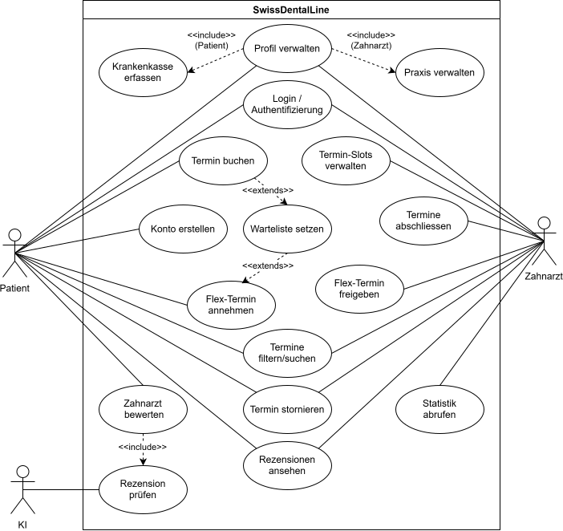

## Use-Case Beschreibung

### UC-01: Login / Authentifizierung

| **Use Case Description** | |
|---|---|
| **ID** | UC-01 |
| **Titel** | Login / Authentifizierung |
| **Vorbedingungen** | Der Benutzer hat ein registriertes Konto |
| **Akteure** | Patient |
| **Ablauf** | 1. Der Benutzer gibt E-Mail und Passwort ein 2. Das System authentifiziert über Auth0 3. Falls erfolgreich, wird der Benutzer zur Homepage weitergeleitet 4. Das System lädt rollenspezifisches Dashboard (Patient/Zahnarzt) |
| **Datendefinitionen** | E-Mail: String (Format: email) Passwort: String (verschlüsselt über Auth0) Rolle: Enum (PATIENT, ZAHNARZT) |
| **Ausnahmen** | 1. Zugangsdaten ungültig → Fehlermeldung anzeigen 2. Account nicht verifiziert → E-Mail-Verifizierung erforderlich 3. Kein Account → Weiterleitung zur Registrierung |

---

### UC-02: Konto erstellen (Registrierung)

| **Use Case Description** | |
|---|---|
| **ID** | UC-02 |
| **Titel** | Konto erstellen |
| **Vorbedingungen** | Keine |
| **Akteure** | Patient |
| **Ablauf** | 1. Der Benutzer wählt "Sign up" 2. Der Benutzer gibt Kontoinformationen ein (E-Mail, Vorname, Nachname, Passwort) 3. Das System erstellt Konto über Auth0 |
| **Datendefinitionen** | E-Mail: String (Format: email, unique) Vorname: String Nachname: String Passwort: String (min. 8 Zeichen, Auth0-Policy) Rolle: Patient |
| **Ausnahmen** | 1. Passwort erfüllt Anforderungen nicht → Validierungsfehler 3. Pflichtfelder fehlen → Formular-Validierung |

---

### UC-03: Profil verwalten

| **Use Case Description** | |
|---|---|
| **ID** | UC-03 |
| **Titel** | Profil verwalten |
| **Vorbedingungen** | Der Benutzer ist eingeloggt |
| **Akteure** | Patient, Zahnarzt |
| **Ablauf (Patient)** | 1. Der Patient wählt "Profil ansehen" 2. Der Patient bearbeitet Geburtsdatum, Krankenkasse, Wohnadresse 3. Das System speichert die Änderungen in der Patient-Collection |
| **Ablauf (Zahnarzt)** | 1. Der Zahnarzt wählt "Profil ansehen" 2. Der Zahnarzt bearbeitet Praxisbezeichnung und Adresse 3. Das System speichert die Änderungen in der Zahnarzt-Collection |
| **Datendefinitionen** | Patient: Geburtsdatum (Date), Krankenkasse (String), Adresse (Adresse-ID) Zahnarzt: Praxisname (String), Adresse (Adresse-ID) |
| **Ausnahmen** | 1. Netzwerkfehler → Änderungen nicht gespeichert, Retry-Option |

---

### UC-04: Termin buchen

| **Use Case Description** | |
|---|---|
| **ID** | UC-04 |
| **Titel** | Termin buchen |
| **Vorbedingungen** | Patient ist eingeloggt, freie Termine verfügbar |
| **Akteure** | Patient |
| **Ablauf** | 1. Der Patient wählt "Termin buchen" 2. Der Patient wählt Behandlungsart aus 3. Das System zeigt verfügbare Termine (gefiltert nach Behandlungsart) 4. Der Patient wählt Zahnarzt und Termin aus 5. Der Patient sieht Zahnarzt-Informationen (inkl. Rezensionen) 6. Der Patient aktiviert optional Warteliste für frühere Termine 7. Der Patient bestätigt Buchung 8. Das System ändert Termin-Status auf "GEBUCHT" und speichert Patient-ID |
| **Datendefinitionen** | Termin: ID, Zahnarzt-ID, Patient-ID, Behandlungsart-ID, Datum (Instant), Dauer (Integer), Preis (Double), Status (TerminStatus), Warteliste-Aktiv (Boolean) |
| **Ausnahmen** | 1. Termin bereits gebucht → Fehlermeldung, neue Auswahl 2. Netzwerkfehler → Rollback, Status bleibt "FREI" |
| **Erweiterungen** | <<extends>> Warteliste setzen (UC-06) |

---

### UC-05: Termine suchen / filtern

| **Use Case Description** | |
|---|---|
| **ID** | UC-05 |
| **Titel** | Termine suchen / filtern |
| **Vorbedingungen** | Benutzer ist eingeloggt |
| **Akteure** | Patient, Zahnarzt |
| **Ablauf** | 1. Der Benutzer wählt "Meine Termine" 2. Das System lädt alle Termine des Benutzers 3. Das System zeigt Termine gefiltert nach Status (GEBUCHT, ABGESCHLOSSEN, ABGESAGT) 4. Der Benutzer kann Termine nach Status filtern und nach Informationen suchen |
| **Datendefinitionen** | Terminliste: Array von Termin-Objekten Filter: Status (Enum)|
| **Ausnahmen** | 1. Keine Termine vorhanden → Leere Liste mit Hinweis |

---

### UC-06: Warteliste setzen

| **Use Case Description** | |
|---|---|
| **ID** | UC-06 |
| **Titel** | Warteliste setzen |
| **Vorbedingungen** | Patient hat einen Termin gebucht |
| **Akteure** | Patient |
| **Ablauf** | 1. Der Patient aktiviert bei Terminbuchung die Checkbox "Warteliste für frühere Termine" 2. Das System setzt `wartelisteAktiv = true` für den gebuchten Termin 3. Bei Flex-Termin-Freigabe prüft das System alle Wartelisten-Termine 4. Das System benachrichtigt den Patienten bei passendem Flex-Termin |
| **Datendefinitionen** | Termin.wartelisteAktiv: Boolean |
| **Ausnahmen** | Keine |

---

### UC-07: Flex-Termin annehmen

| **Use Case Description** | |
|---|---|
| **ID** | UC-07 |
| **Titel** | Flex-Termin annehmen |
| **Vorbedingungen** | Patient auf Warteliste, Flex-Termin verfügbar |
| **Akteure** | Patient |
| **Ablauf** | 1. Der Patient öffnet die Flex-Termin-Angebote 2. Der Patient wählt "Flex-Termine ansehen" 3. Das System zeigt verfügbare Flex-Termine 4. Der Patient wählt Flex-Angebot und bestätigt Umbuchung 5. Das System bucht storniert alten Flex-Termin 6. Das System ändert Status des alten Termins auf "ABGESAGT" 7. Das System ändert Status des Flex-Termins auf "GEBUCHT" |
| **Datendefinitionen** | Flex-Termin: Termin mit Status "FLEX" |
| **Ausnahmen** | 1. Flex-Termin kann abgelehnt werden |

---

### UC-08: Termin stornieren

| **Use Case Description** | |
|---|---|
| **ID** | UC-08 |
| **Titel** | Termin stornieren |
| **Vorbedingungen** | Benutzer hat gebuchten Termin |
| **Akteure** | Patient, Zahnarzt |
| **Ablauf** | 1. Der Benutzer wählt gebuchten Termin aus 2. Der Benutzer klickt "Termin stornieren" 3. Das System zeigt Bestätigungsdialog 4. Der Benutzer bestätigt Stornierung 5. Das System ändert Status auf "ABGESAGT"|
| **Datendefinitionen** | Termin.status: TerminStatus.ABGESAGT |
| **Ausnahmen** | 1. Stornierung sollte frühzeitig genug gemacht werden, sodass dieser durch Flex-Termine umgebucht werden kann |

---

### UC-09: Rezension schreiben

| **Use Case Description** | |
|---|---|
| **ID** | UC-09 |
| **Titel** | Rezension schreiben |
| **Vorbedingungen** | Patient hat abgeschlossenen Termin |
| **Akteure** | Patient |
| **Ablauf** | 1. Der Patient wählt abgeschlossenen Termin 2. Der Patient klickt "Zahnarzt bewerten" 3. Der Patient gibt Bewertung (1-5 Sterne) und Text ein 4. Der Patient sendet Rezension 5. Das System triggert KI-Prüfung (UC-13) 6. Bei APPROVED: Rezension wird veröffentlicht 7. Bei REJECTED: Patient erhält Ablehnungsgrund |
| **Datendefinitionen** | Rezension: ID, Zahnarzt-ID, Patient-ID, Bewertung (Integer 1-5), Text (String), Datum (Instant), Approved (Boolean), AI-Kommentar (String) |
| **Ausnahmen** | 1. Termin noch nicht abgeschlossen → Funktion nicht verfügbar 2. Rezension bereits geschrieben → Hinweis auf Bearbeitungsmöglichkeit |
| **Include-Beziehung** | <<include>> Rezension prüfen (UC-12) |

---

### UC-10: Rezensionen ansehen

| **Use Case Description** | |
|---|---|
| **ID** | UC-11 |
| **Titel** | Rezensionen ansehen |
| **Vorbedingungen** | Keine |
| **Akteure** | Patient, Zahnarzt |
| **Ablauf (Patient)** | 1. Der Patient wählt Zahnarzt aus 2. Das System zeigt alle verifizierten Rezensionen (approved = true) 3. Der Patient sieht Durchschnittsbewertung und Einzelbewertungen |
| **Ablauf (Zahnarzt)** | 1. Der Zahnarzt wählt "Meine Rezensionen" 2. Das System zeigt alle Rezensionen (verifizierte + abgelehnte) 3. Der Zahnarzt sieht bei abgelehnten Rezensionen den AI-Kommentar |
| **Datendefinitionen** | Rezensionsliste: Array von Rezension-Objekten Filter: Nur approved (für Patienten) |
| **Ausnahmen** | 1. Keine Rezensionen vorhanden → Leere Liste |

---

### UC-11: Termin-Slots verwalten

| **Use Case Description** | |
|---|---|
| **ID** | UC-11 |
| **Titel** | Termin-Slots verwalten |
| **Vorbedingungen** | Zahnarzt ist eingeloggt |
| **Akteure** | Zahnarzt |
| **Ablauf (Slot erstellen)** | 1. Der Zahnarzt wählt "Slot erstellen" 2. Der Zahnarzt gibt Behandlungsart, Dauer, Preis, Datum ein 3. Das System erstellt neuen Termin mit Status "FREI" 4. Das System speichert Termin in Terminliste |
| **Ablauf (Slot bearbeiten)** | 1. Der Zahnarzt wählt freien Termin aus 2. Der Zahnarzt bearbeitet Behandlungsart, Dauer, Preis, Datum 3. Das System speichert Änderungen |
| **Ablauf (Slot löschen)** | 1. Der Zahnarzt wählt freien Termin aus 2. Der Zahnarzt klickt "Löschen" 3. Das System löscht Termin |
| **Datendefinitionen** | Termin: Zahnarzt-ID, Behandlungsart-ID, Datum (Instant), Dauer (Integer), Preis (Double), Status (TerminStatus.FREI) |
| **Ausnahmen** | 1. Slot bereits gebucht → Bearbeitung/Löschung nicht möglich 2. Pflichtfelder fehlen → Validierungsfehler |

---

### UC-12: Rezension prüfen (KI)

| **Use Case Description** | |
|---|---|
| **ID** | UC-12 |
| **Titel** | Rezension prüfen |
| **Vorbedingungen** | Neue Rezension wurde eingereicht |
| **Akteure** | KI (ReviewModerationService) |
| **Ablauf** | 1. Das System erhält neue Rezension 2. Das System sendet Rezensionstext an ReviewModerationService 3. Der Service analysiert Text mit OpenAI GPT 4. Die KI prüft auf Beleidigungen, Diskriminierung, Hassrede 5. Die KI gibt APPROVED oder REJECTED mit Begründung zurück 6. Bei APPROVED: System setzt approved = true, Rezension wird veröffentlicht 7. Bei REJECTED: System setzt approved = false, speichert AI-Kommentar |
| **Datendefinitionen** | ModerationResult: approved (Boolean), reason (String) Rezension.approved: Boolean Rezension.aiKommentar: String |
| **Ausnahmen** | Keine |

---

### UC-14: Termin abschliessen

| **Use Case Description** | |
|---|---|
| **ID** | UC-14 |
| **Titel** | Termin abschliessen |
| **Vorbedingungen** | Termin ist gebucht |
| **Akteure** | Zahnarzt |
| **Ablauf** | 1. Der Zahnarzt wählt gebuchten Termin aus 2. Der Zahnarzt klickt "Termin abschliessen" 3. Das System ändert Status auf "ABGESCHLOSSEN" 4. Das System aktualisiert Statistiken (Einnahmen, Auslastung) 5. Das System ermöglicht Patient Rezension zu schreiben |
| **Datendefinitionen** | Termin.status: TerminStatus.ABGESCHLOSSEN |
| **Ausnahmen** | 1. Termin noch nicht abgeschlossen → Funktion nicht verfügbar |

---

### UC-15: Flex-Termin freigeben

| **Use Case Description** | |
|---|---|
| **ID** | UC-15 |
| **Titel** | Flex-Termin freigeben |
| **Vorbedingungen** | Termin wurde abgesagt |
| **Akteure** | Zahnarzt |
| **Ablauf** | 1. Ein Patient sagt Termin ab (Status → ABGESAGT) 2. Der Zahnarzt wählt abgesagten Termin aus 3. Der Zahnarzt klickt "Als Flex-Termin freigeben" 4. Das System ändert Status auf "FLEX" 5. Das System prüft alle Termine mit wartelisteAktiv = true 6. Das System filtert Patienten mit passender Behandlungsart und ausreichender Dauer 7. Das System benachrichtigt alle passenden Patienten |
| **Datendefinitionen** | Termin.status: TerminStatus.FLEX Benachrichtigung: Patient-ID, Termin-ID, Zeitstempel |
| **Ausnahmen** | 1. Keine Patienten auf Warteliste → Termin bleibt FLEX, wird für alle sichtbar 2. Alle benachrichtigten Patienten lehnen ab → Termin bleibt FLEX |

---

### UC-16: Statistik abrufen

| **Use Case Description** | |
|---|---|
| **ID** | UC-16 |
| **Titel** | Statistik abrufen |
| **Vorbedingungen** | Zahnarzt ist eingeloggt, Termine vorhanden |
| **Akteure** | Zahnarzt |
| **Ablauf** | 1. Der Zahnarzt wählt "Statistik ansehen" 2. Der Zahnarzt filtert Zeitraum (Woche, Monat, Jahr, Gesamt) 3. Das System aggregiert Daten: &nbsp;&nbsp;&nbsp;- Anzahl Termine nach Status &nbsp;&nbsp;&nbsp;- Gesamteinnahmen &nbsp;&nbsp;&nbsp;- Durchschnittliche Auslastung (%) &nbsp;&nbsp;&nbsp;- Anteil Flex-Termine 4. Das System zeigt Statistiken als Diagramme und Kennzahlen |
| **Datendefinitionen** | TerminStatusAggregationDTO: status (TerminStatus), count (Integer) Zeitraum: startDate (Instant), endDate (Instant) Statistiken: totalEinnahmen (Double), auslastung (Double), flexAnteil (Double) |
| **Ausnahmen** | 1. Keine Daten im gewählten Zeitraum → Leere Statistik |

--- 

## Fachliches Datenmodell 
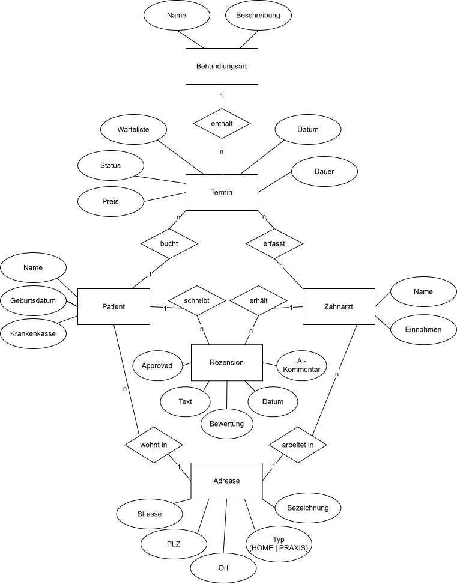

Dieses Kapitel beschreibt das fachliche Datenmodell ohne technische IDs. Grundlage sind das ER‑Diagramm sowie die bereitgestellten Mockdaten. Die zentralen Entitäten sind Patient, Zahnarzt, Adresse, Behandlungsart, Termin und Rezension. Beziehungen und Zustände sind fachlich definiert.

### Entitäten und Attribute

#### Patient
- Name: Vollständiger Name
- Geburtsdatum: Datum
- Krankenkasse: Kassenname
- Adresse: wohnt in einer Adresse (n:1)

#### Zahnarzt
- Name: Vollständiger Name
- Praxisadresse: arbeitet in einer Adresse (n:1)
- Einnahmen: fachlich als Summe der Preise abgeschlossener Termine (abgeleitet, wird nicht gespeichert)

#### Adresse
- Strasse: Text
- PLZ: Text (fachlich als Postleitzahl)
- Ort: Text
- Typ: HOME | PRAXIS
- Bezeichnung: Praxisname (nur gesetzt bei Typ = PRAXIS)

#### Behandlungsart
- Name: Bezeichnung der Behandlung (z. B. „Dentalhygiene“)
- Beschreibung: Kurzbeschreibung (z. B. „Professionelle Zahnreinigung“)

#### Termin
- Datum: Zeitpunkt der Behandlung
- Dauer: Minuten (positiv, z. B. 15/30/45/60/90)
- Preis: Betrag ≥ 0
- Status: TerminStatus (siehe Zustände unten)
- Warteliste aktiv: Ja/Nein (Patient möchte früheren Slot erhalten)
- Beziehungen:
    - gehört zu genau einer Behandlungsart (1:1)
    - wird von einem Zahnarzt erfasst (1:n)
    - kann von einem Patient gebucht werden (0:n)

#### Rezension
- Bewertung: Zahl 1..5 (Sterne)
- Text: Freitext
- Datum: Zeitpunkt der Abgabe
- Approved: Ja/Nein (Freigabezustand)
- AI‑Kommentar: optionale Begründung der Moderation (nur bei Ablehnung)
- Beziehungen:
    - wird von einem Patient geschrieben (0:n)
    - bezieht sich auf einen Zahnarzt (0:n)

### Beziehungen (fachlich/kardinal)
- Patient → Adresse: n:1 „wohnt in“
- Zahnarzt → Adresse: n:1 „arbeitet in“
- Zahnarzt → Termin: 1:n „erfasst“
- Patient → Termin: 0:n „bucht“
- Termin → Behandlungsart: 1:1 „enthält“
- Patient → Rezension: 0:n „schreibt“
- Zahnarzt → Rezension: 0:n „erhält“

### Zustände und Übergänge

#### TerminStatus
Fachlich zulässige Zustände: FREI, GEBUCHT, ABGESAGT, FLEX, ABGESCHLOSSEN.
- FREI → GEBUCHT: Patient bestätigt Buchung; Termin ist verbindlich.
- GEBUCHT → ABGESAGT: Patient/Zahnarzt storniert; Termin wird freigegeben.
- ABGESAGT → FLEX: Zahnarzt kennzeichnet abgesagten Slot als Flex‑Termin und löst Wartelisten‑Benachrichtigungen aus.
- FLEX → GEBUCHT: Patient mit aktiver Warteliste nimmt Flex‑Angebot an; Umbuchung erfolgt.
- GEBUCHT → ABGESCHLOSSEN: Behandlung durchgeführt; Termin zählt in Statistik/Einnahmen.

Fachliche Regeln:
- Preis ≥ 0; Dauer > 0 Minuten.
- Ein FLEX‑Termin ist fachlich „frei für Umbuchung“ und in der Regel ohne zugeordneten Patient bis zur Annahme.
- Warteliste aktiv = Ja: System darf Patient bei passenden Flex‑Terminen informieren und anzeigen.

#### RezensionStatus (fachlich)
Zustände: APPROVED | REJECTED (durch KI‑Moderation).
- APPROVED: Veröffentlichung auf Zahnarzt‑Profil; zählt zur Durchschnittsbewertung.
- REJECTED: Ablehnung mit Begründung (AI‑Kommentar), keine Veröffentlichung.

Fachliche Regeln:
- Bewertung ∈ {1,2,3,4,5}.
- Text muss respektvoll sein; beleidigende oder diskriminierende Inhalte führen zur Ablehnung.

## UI-Mockup 

Die nachfolgenden Wireframes zeigen die frühen Mockups der Oberfläche von SwissDentalLine für alle Nutzerrollen: Globale Ansichten (Login, Registrierung, Profil), Patient-Dashboard mit Terminbuchung und Wartelisten-Management, sowie Zahnarzt-Verwaltung mit Slot-Konfiguration und Statistiken.

### Global – Allgemeine Seiten

#### Homescreen
Zentrale Landingpage mit Navigation zu Patient- oder Zahnarzt-Bereich. 

#### Login
Sichere Anmeldung mit Auth0-Integration für Patienten und Zahnärzte. 

#### Registrierung
Einfache Registrierung neuer Benutzerkonten. 

#### Profilübersicht
Verwaltung persönlicher Daten, Krankenkasse und Adressinformationen für Patienten. 

### Patient – Patientenansichten

#### Patient Startseite
Dashboard mit Übersicht der nächsten Termine, Wartelisten-Status und schnellem Zugang zur Terminsuche. 

#### Behandlung auswählen
Filterung verfügbarer Termine nach Behandlungsart (z.B. Dentalhygiene, Füllungen, Zahnreinigung). 

#### verfügbaren Termin auswählen
Kalender-Ansicht verfügbarer Termine mit Preis, Dauer und Verfügbarkeitsstatus. 

#### Zahnarzt auswahl
Auswahl des gewünschten Zahnarztes mit Anzeige von Bewertungen und Praxisstandort. 

#### Warteliste
Verwaltung von Wartelisten-Einträgen mit Prioritäten und Benachrichtigungsstatus für frühere Termine. 

#### Übersicht der Termin-Auswahl
Zusammenfassung des gewählten Termins mit allen Details vor der finalen Buchung. 

#### Terminbuchung
Abschlussseite mit Bestätigung der Terminbuchung. 

#### Flex-Termin
Angebot verfügbarer Flex-Termine (abgesagte Slots) für wartende Patienten. 

#### Flex Termin annehmen
Bestätigungs-Dialog zur Umbuchung vom ursprünglichen auf einen früheren Flex-Termin. 

### Zahnarzt – Zahnarzt-Verwaltungsansichten

#### Zahnarzt Dashboard
Zentrale Verwaltungsoberfläche mit Übersicht der anstehenden Termine, Auslastung und schnellster Zugang zu Slot-Verwaltung. 

#### Slots freigeben
Konfiguration und Freigabe neuer Zeitslots mit Behandlungsart, Dauer und Preis. 

#### Flex-Termin freigeben
Umwandlung abgesagter Termine in flexible Slots mit automatischer Benachrichtigung wartender Patienten. 

#### Statistiken ansehen
Analytics-Dashboard mit Auslastung, Einnahmen, Behandlungsverteilung und Flex-Termin-Quoten im zeitlichen Verlauf. 
.png)

# Implementation

## Frontend

### Umsetzung & Technologie
Das Frontend basiert auf SvelteKit (Routing, Server/Client-Hooks) und Vite (Build/Dev-Server) mit klaren Layouts und Stores für Zustandsverwaltung. Die UI ist vollständig responsiv (Mobile/Tablet/Desktop) und nutzt wiederverwendbare Komponenten für Karten, Listen, Formulare und Dialoge. Navigation und Header sind global eingebunden; ein eigenes SwissDentalLine‑Logo ist erstellt und im Header platziert.

### Themes‑basierte Rollenansicht
Zur visuellen Orientierung werden rollenspezifische Farbschemata eingesetzt: Patientansichten sind im türkisen Theme gehalten, Zahnarztansichten im blauen Theme. Dadurch ist die Rollenführung jederzeit eindeutig erkennbar, auch bei gemeinsamen Komponenten.

### Wiederverwendbare Komponenten
- Karten:
    - BehandlungCard: Darstellung einer Behandlungsart mit Kurzinfos.
    - TerminSlotCard: Konfiguration und Anzeige von freien Slots (Zahnarzt).
    - TerminCard: Zusammenfassung eines Termins inkl. Status/Preis/Dauer.
    - NextTerminCard: nächster anstehender Patiententermin als Highlight.
    - FlexTerminCard: Darstellung von Flex‑Terminen (neu freigegebene Slots).
    - KPICard / StatCard: Kennzahlen und Statistiken im Dashboard.
    - RezensionCard: geprüfte Patientenbewertungen zu einem Zahnarzt.
- Funktional:
    - BookingProgressBar: Fortschrittsanzeige im Buchungs‑Flow.
    - ConfirmDialog: Bestätigungsdialoge (z. B. Stornieren/Umbuchen).
    - EmptyState: leere Zustände mit Hinweisen/CTAs.
    - InfoBanner: Hinweise/Statusmeldungen (z. B. Warteliste aktiv).
    - Pagination: Seitennavigation für lange Listen.
- Übersichten:
    - HomeLanding: globale Startseite mit Rollenwahl.
    - PatientOverview: Patienten‑Dashboard (Termine, Warteliste, Historie).
    - ZahnarztOverview: Praxis‑Dashboard (Slots, Flex, KPIs, Rezensionen).

### Testdaten (Rollen)
- Patient: Tim Baumann  · E-Mail: tim.baumann@sdl.ch  · Passwort: SwissDental25
- Zahnarzt: Markus Huber  · E-Mail: markus.huber@sdl.ch  · Passwort: SwissDental25

### Screenshots (Global)

#### Startseite (Homescreen)
Homescreen als Einstiegspunkt: klare Navigation zu Patienten‑ und Zahnarztbereich; Zugang zu Kernprozessen wie Terminsuche und Rezensionen ansehen.
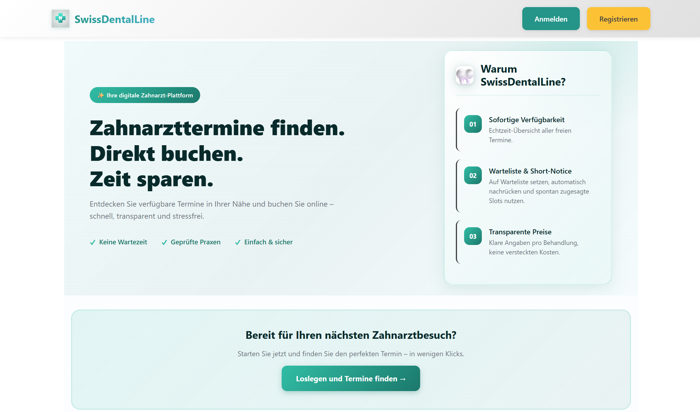

#### Login
Anmeldung: Auth0‑basierte Authentifizierung mit Feldvalidierung, Fehlerfeedback und anschliessender Weiterleitung ins rollenbasierte Dashboard (Patient/Zahnarzt).
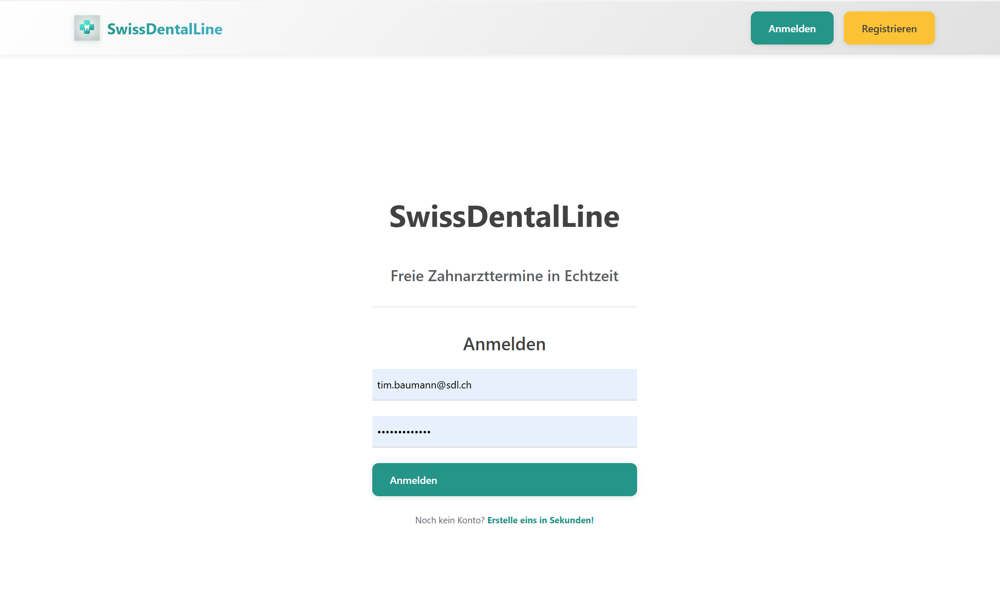

#### Registrierung (Signup)
Registrierung: aktuell ausschliesslich für Patienten, erstellt automatisch ein Auth0‑Konto mit Rolle PATIENT und legt einen Eintrag in der Patient‑Kollektion an. Pflichtfelder werden validiert.
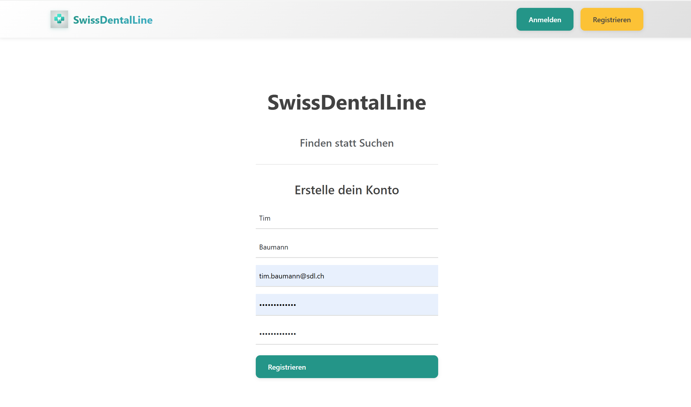

### Screenshots (Patient)

#### Patientenübersicht und Termine
Die Übersicht zeigt nächste Termine, offene Aktionen und den Status der Warteliste, und bietet eine klare Navigation zu Buchung und Historie. Kacheln sind klickbar und führen direkt in die passenden Bereiche, zum Beispiel, führt Geplante Termine in die Terminübersicht, führt Termine bewerten in die Terminübersicht mit vorgewähltem Filter Abgeschlossen, führt Offene Warteliste in die Terminübersicht mit aktiviertem Umschalter Warteliste, und führt Verfügbare Flex Termine in die Unterseite Flex Termine. Alle Kennzahlen werden dynamisch geladen und aktualisieren sich bei Änderungen.
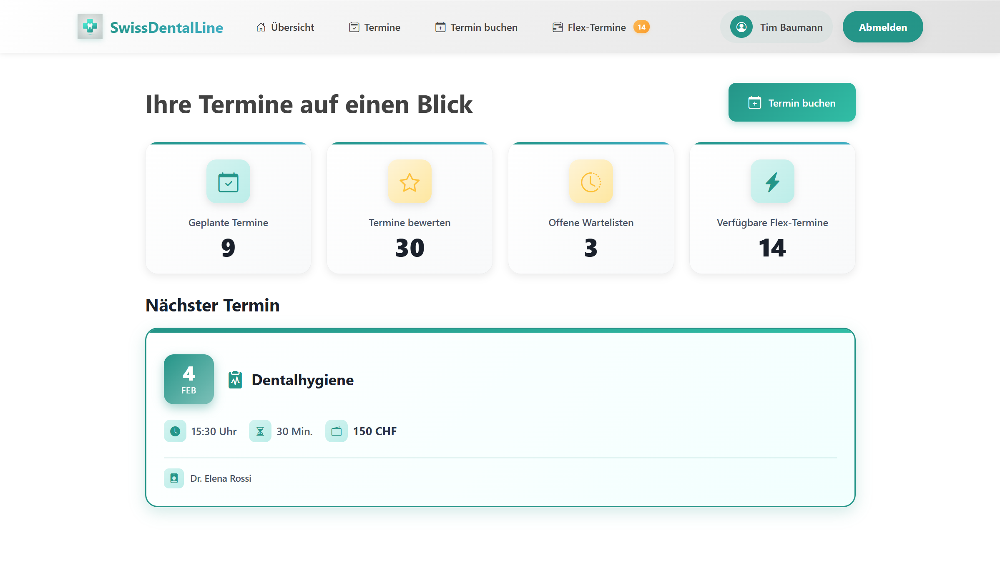

Die Terminübersicht listet alle Termine, und unterstützt mehrere Filter und Suche für schnelle Orientierung. Es gibt Statusfilter für Gebucht, Abgeschlossen und Abgesagt, einen Umschalter für nur Wartelisten Termine, sowie eine Freitextsuche nach Termininformationen und Behandlungsart.
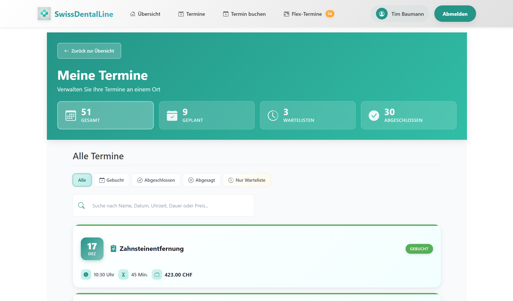

Die Detailansicht eines Termins zeigt Zeitpunkt, Dauer, Preis und die zugehörige Zahnarztinformation sowie mögliche Aktionen. Je nach Status können hier Stornieren, Warteliste aktivieren oder nach Abschluss Bewerten ausgelöst werden.
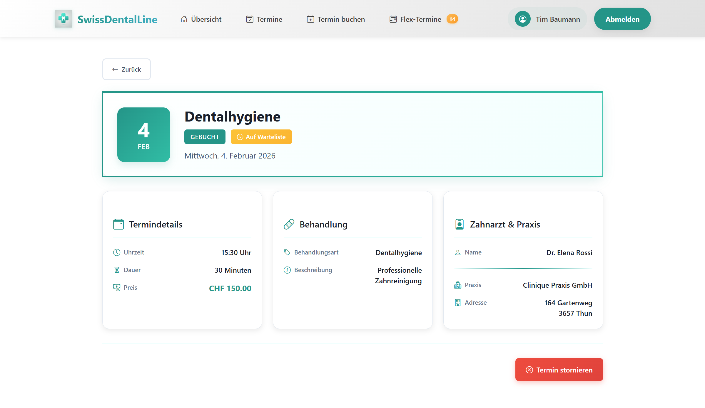

#### Profilverwaltung
Die Profilübersicht zeigt persönliche Daten, die Krankenkasse und die Adresse, mit direktem Zugriff auf Bearbeiten. Von hier gelangt der Benutzer auch zu seinen erfassten Rezensionen.
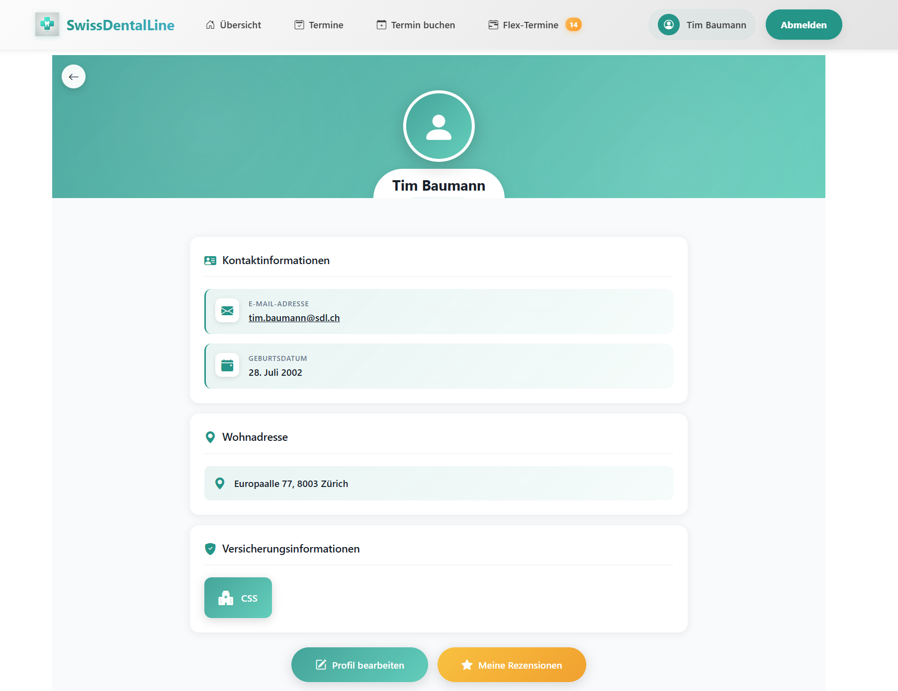

Das Bearbeitungsformular erlaubt Anpassungen an Geburtsdatum, Krankenkasse und Wohnadresse, mit Validierung und Fehlermeldungen bei falschen Eingaben.

#### Terminbuchung
Die Auswahl der Behandlungsart erleichtert die gezielte Terminsuche nach Leistung.

Kalender und Listenansicht zeigen verfügbare Termine mit Preis und Dauer für die Auswahl, und unterstützen eine schnelle Filterung nach passenden Zeitfenstern.

Die Zahnarztansicht zeigt Praxisadresse, Bewertungen und verfügbare Leistungen für eine informierte Wahl der Behandlung und des Anbieters.

Weitere Zahnarztinformationen und verfügbare Zeitfenster werden kompakt dargestellt, und die Rezensionen des Zahnarztes sind sichtbar, sodass sich der Benutzer ein Bild der Qualität machen kann.

Die Option Warteliste aktivieren kennzeichnet den gebuchten Termin für frühere passende Zeiten und löst Benachrichtigungen in der Anwendung aus, sobald ein geeigneter Slot frei wird. Die Prüfung erfolgt gegen Behandlungsart, Dauer und einen früheren Zeitpunkt, und der aktive Status wird in der Übersicht angezeigt.
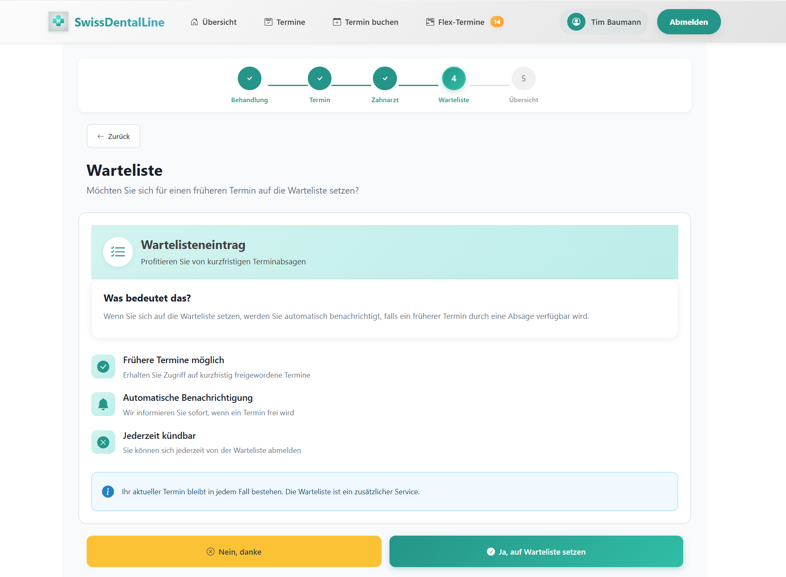

Die Zusammenfassung vor der Bestätigung fasst alle Buchungsdaten transparent zusammen und bietet eine letzte Kontrolle von Zahnarzt, Behandlungsart, Datum, Dauer und Preis.
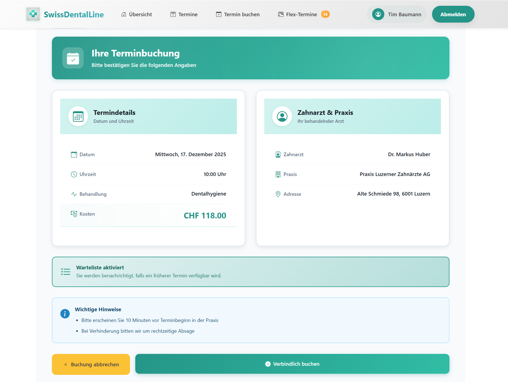

#### Flex Termine
Die Übersicht zeigt freigegebene Flex Termine, die für den aktiven Benutzer passend sind. Die Vorschläge entstehen aus den gebuchten Terminen mit aktivierter Warteliste, und werden nach Behandlungsart gefiltert und regelmässig aktualisiert.
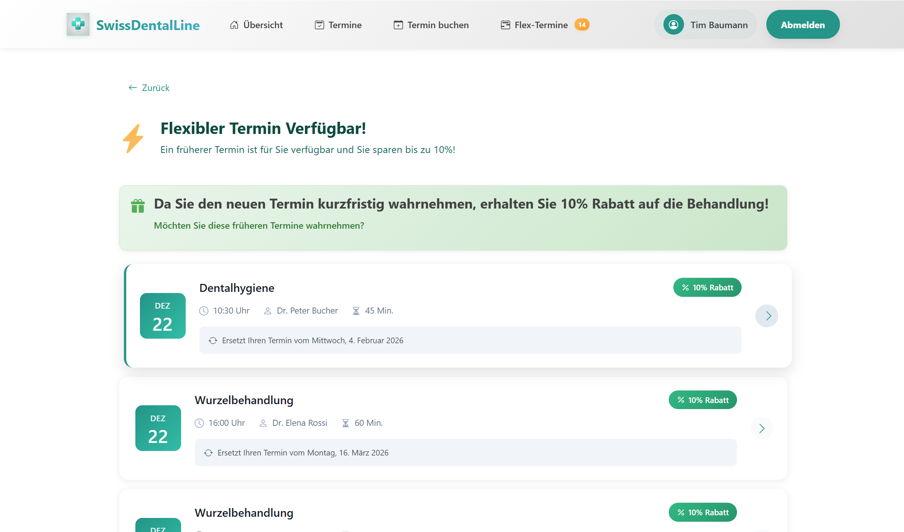

Der Annahme Dialog ermöglicht die Umbuchung auf eine frühere freie Zeit, mit einer klaren Bestätigung und einer Vorschau der Änderungen. Der ursprüngliche Termin wird nach der Bestätigung automatisch storniert, und der neue Termin wird gebucht.

Der Abschluss der Umbuchung zeigt die neue Terminzuweisung und die Bestätigung der erfolgten Benachrichtigung an den Benutzer.

#### Rezensionen
Nach Abschluss eines Termins wird die Bewertungsfunktion aktiviert und in der Terminübersicht sichtbar gemacht, sodass der Benutzer direkt eine Rezension erfassen kann.

Die Bewertungsmaske ermöglicht eine Auswahl von einem bis fünf Sternen sowie einen Freitextkommentar für den Zahnarzt und zeigt Hinweise zu respektvollem Sprachgebrauch.

Die Vorschau bieten eine letzte Kontrolle des Textes und der Bewertung.

Die KI Moderation startet unmittelbar nach dem Absenden und prüft den Text auf unangemessene Inhalte, und entscheidet über die Freigabe. Bei Freigabe erscheint die Rezension öffentlich, und bei Ablehnung wird der Grund angezeigt, und die Rezension bleibt verborgen.
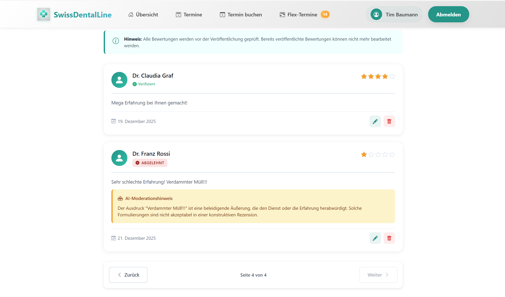

Die Liste zeigt veröffentlichte Bewertungen und Durchschnittswerte für eine transparente Auswahl, und kennzeichnet abgelehnte Rezensionen mit dem KI-Kommentar. Diese Rezensionsanisicht ist über den Button in der Profilansicht erreichbar. 
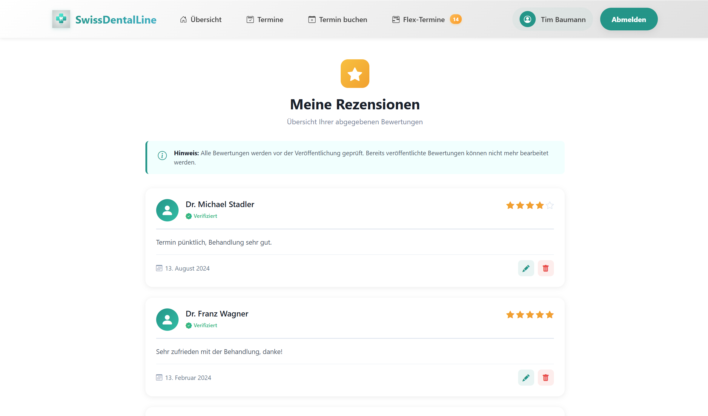

Die Bearbeitungsfunktion erlaubt Korrekturen an bereits erfassten Rezensionen, mit anschliessender erneuter Prüfung durch die KI Moderation.
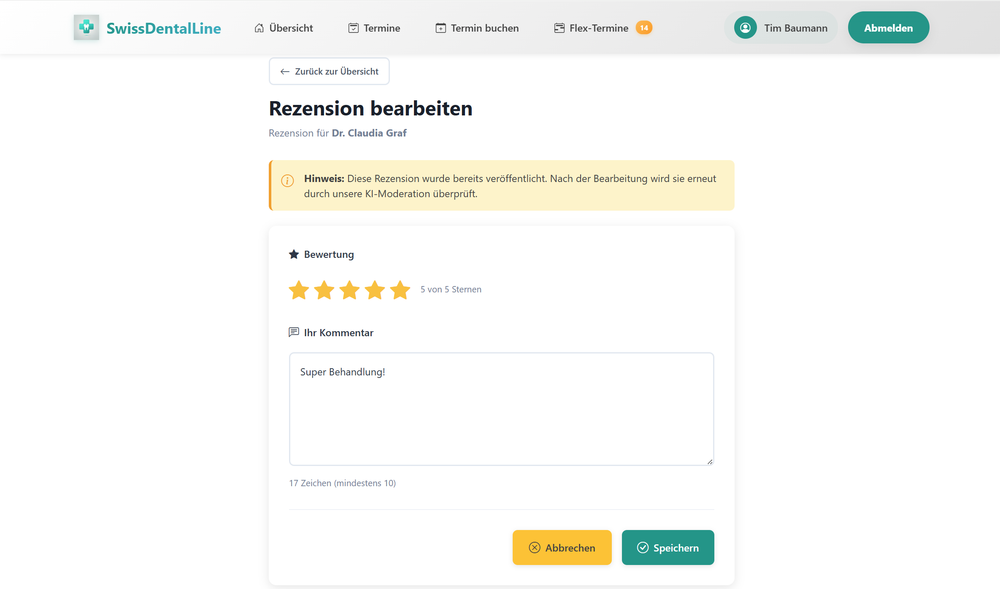

### Screenshots (Zahnarzt)

#### Praxis Dashboard
Das Praxis Dashboard zeigt anstehende Termine, Kennzahlen zur Auslastung und schnelle Einstiege in Slot Verwaltung, Flex Freigaben und Statistiken. Karten sind klickbar und führen direkt in Terminübersicht oder Slot Management, und Kennzahlen aktualisieren sich dynamisch bei Änderungen.
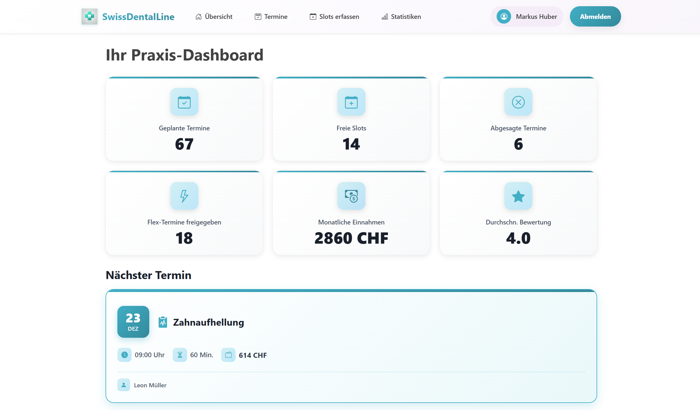

#### Terminübersicht und Details
Die Terminübersicht listet alle Termine mit Status und bietet Filter nach Zeitraum und Status sowie eine Suche nach Termininformationen und Behandlungsart. Ein Klick auf einen Eintrag öffnet die Detailansicht mit Zeitpunkt, Dauer, Preis und Patienteninformationen.
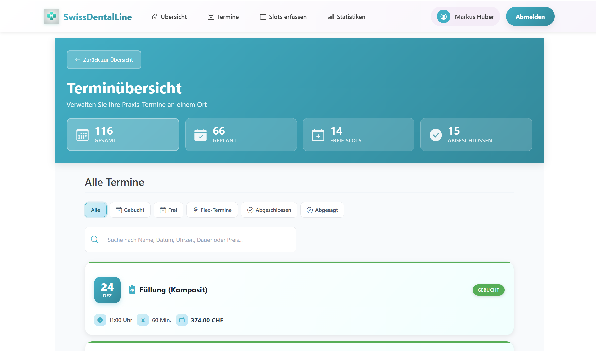

Die Detailansicht eines Termins zeigt alle relevanten Informationen und erlaubt kontextabhängige Aktionen. Bei gebuchten Terminen kann der Zahnarzt den Termin abschliessen, wodurch der Status auf Abgeschlossen gesetzt wird und Statistiken aktualisiert werden.
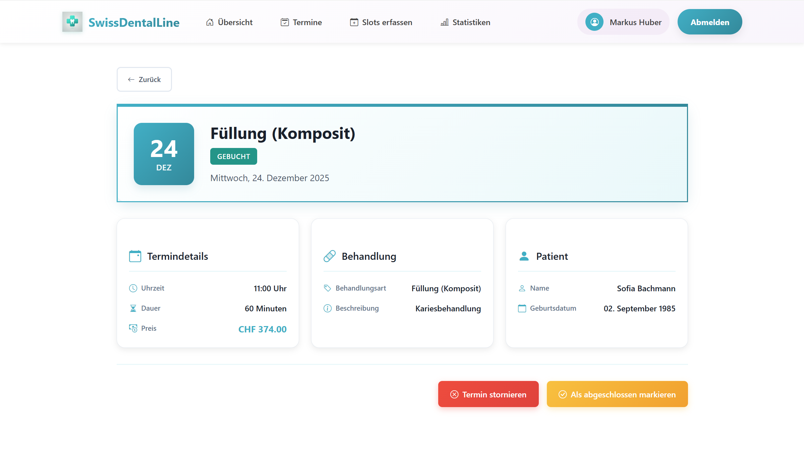

Der Abschluss eines Termins bestätigt die erbrachte Behandlung und aktiviert die Bewertungsfunktion für den zugehörigen Patienten. Einnahmen und Auslastung werden im Hintergrund aggregiert und im Statistikbereich sichtbar.

#### Slot Verwaltung
Die Slot Verwaltung ermöglicht das Erstellen freier Zeitfenster mit Behandlungsart, Dauer, Preis und Zeitpunkt. Neue Slots erscheinen als freie Termine in der Übersicht und stehen Patienten zur Buchung zur Verfügung.

Die Übersicht zur Slot Verwaltung fasst verfügbare freie Zeitfenster zusammen und zeigt deren Eigenschaften kompakt. Von hier sind Erstellen, Bearbeiten und Löschen erreichbar, und der Status eines Slots ist jederzeit sichtbar.

Freie Slots können bearbeitet werden, solange sie nicht gebucht sind, zum Beispiel Anpassung von Zeitpunkt, Dauer und Preis. Änderungen werden unmittelbar übernommen und in der Terminübersicht angezeigt.

Nicht mehr benötigte freie Slots können gelöscht werden, sofern keine Buchung vorliegt. Das System verhindert versehentliche Löschungen durch einen Bestätigungsdialog und zeigt danach die aktualisierte Liste.

#### Flex Termin freigeben
Wenn ein Patient einen Termin absagt, kann der Zahnarzt den Slot als Flex Termin freigeben. Das System prüft alle wartelisteAktiven Termine mit passender Behandlungsart, benachrichtigt passende Patienten und ermöglicht Umbuchungen auf frühere Zeiten. Der Status des Termins wird somit auf "FLEX" geändert.

#### Profil und Rezensionen
Die Profilansicht zeigt Praxisdaten und Adresse und bietet den direkten Zugriff auf das Bearbeiten der Praxisinformationen. Änderungen an Praxisbezeichnung und Standort werden gespeichert und in der gesamten Anwendung sichtbar.
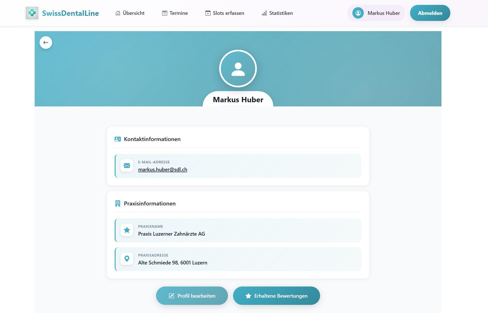

Das Bearbeitungsformular erlaubt Anpassungen an Praxisangaben und Adresse, mit Validierungen für Pflichtfelder und Format. Nach dem Speichern werden die aktualisierten Daten im Dashboard und in Termindetails angezeigt.

Das spezifische Formular für Praxisangaben erlaubt die präzise Pflege der Praxisbezeichnung und der Anschrift. Die Eingaben werden geprüft und nach Bestätigung übernommen, und nachfolgend überall konsistent dargestellt.

Die Rezensionsliste zeigt alle Bewertungen zum Zahnarzt inklusive abgelehnter Einträge mit AI Kommentar. Durchschnittswerte und Verteilungen helfen bei der Einschätzung der Reputation und sind Grundlage für Qualitätsmanagement.
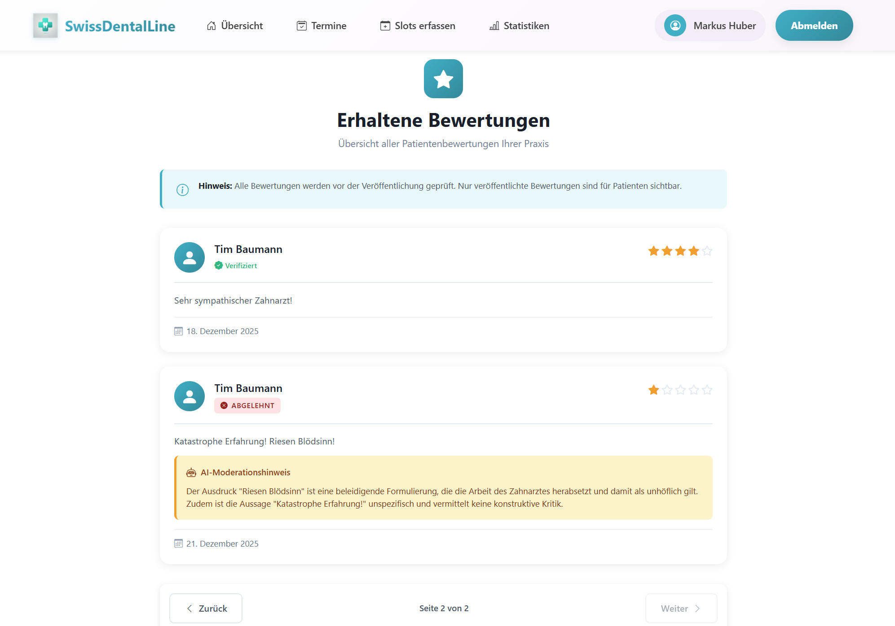

#### Statistiken
Die Statistik Übersicht zeigt Kennzahlen zur Auslastung, Einnahmen und Terminen nach Status und Behandlungsart. Filter für Woche, Monat, Jahr und Gesamt erlauben flexible Analysen, und Diagramme ergänzen die KPIs für einen schnellen Überblick.

Weitere Statistikansichten vertiefen die Auswertung nach Zeiträumen und Kategorien und zeigen Trends über die Zeit. Der Anteil von Flex Terminen und die durchschnittliche Auslastung sind hier besonders hervorgehoben und unterstützen Entscheidungen zur Slot Planung.

## KI-Funktionen

SwissDentalLine nutzt **Spring AI** mit dem **OpenAI GPT-Modell** zur automatischen Moderation von Patientenrezensionen. Die KI-Integration stellt sicher, dass nur qualitativ hochwertige und respektvolle Bewertungen auf der Plattform veröffentlicht werden.

### Einsatzbereich und Zweck

Die KI kommt gezielt im **Rezensionsprozess** zum Einsatz und prüft jeden Bewertungstext automatisch, bevor er auf dem Zahnarztprofil erscheint. Ohne diese Moderation könnten rufschädigende, beleidigende oder irrelevante Inhalte die Qualität und Vertrauenswürdigkeit der Plattform gefährden.

**Wo wird die KI verwendet:**
- Im Backend Service `ReviewModerationService.java` im Package `ch.zhaw.swissdentalline.service`
- Triggerpunkt: Unmittelbar nach dem Absenden einer neuen Rezension durch den Patienten
- Auch bei der Bearbeitung bestehender Rezensionen wird eine erneute Prüfung durchgeführt

### Funktionsweise und Ablauf

Der Moderationsprozess läuft vollautomatisch in folgenden Schritten ab:

1. **Eingabe**: Patient sendet Rezension mit Bewertung (1–5 Sterne) und Freitext über das Frontend
2. **Backend Verarbeitung**: RezensionController empfängt die Anfrage und ruft RezensionService auf
3. **KI Analyse**: ReviewModerationService sendet den Rezensionstext mit einem strukturierten Prompt an das OpenAI GPT-Modell
4. **Prompt Engineering**: Das Modell erhält klare Anweisungen zur Prüfung auf:
   - Beleidigungen und Beschimpfungen
   - Diskriminierende Äußerungen (Geschlecht, Herkunft, Religion, etc.)
   - Hassrede und bedrohliche Inhalte
   - Spam, Werbung und irrelevante Inhalte
   - Respektlosigkeit und unangemessene Sprache
5. **Entscheidung**: Das Modell gibt zurück:
   - `APPROVED`: Rezension ist akzeptabel und wird veröffentlicht
   - `REJECTED`: Rezension verletzt Richtlinien und wird blockiert
   - `Begründung`: Detaillierter Kommentar, warum die Rezension abgelehnt wurde
6. **Speicherung**: Die Rezension wird mit den Feldern `approved` (Boolean) und `aiKommentar` (String) in MongoDB gespeichert
7. **Rückmeldung**: 
   - Bei APPROVED: Rezension erscheint sofort öffentlich auf dem Zahnarztprofil
   - Bei REJECTED: Patient erhält Ablehnungsgrund im Frontend angezeigt

### Qualitätssicherung und Mehrwert

**Vorteile für Zahnärzte:**
- Schutz vor rufschädigenden und beleidigenden Inhalten
- Automatische Filterung von Fake-Rezensionen und Spam
- Transparente Begründungen bei Ablehnungen
- Reduzierter manueller Moderationsaufwand

**Vorteile für Patienten:**
- Schnelle Rückmeldung (keine manuelle Wartezeit)
- Klare Erklärung bei Ablehnung mit Möglichkeit zur Überarbeitung
- Vertrauenswürdige Bewertungsbasis für eigene Zahnarzt-Auswahl

**Vorteile für die Plattform:**
- Automatisierung des Moderationsprozesses skaliert mit wachsender Nutzerzahl
- Konsistente Qualitätskriterien durch KI-Modell
- Reduktion rechtlicher Risiken durch proaktive Inhaltsfilterung
- Höhere Plattform-Qualität und Vertrauen der Nutzer

# Testing

Das SwissDentalLine Projekt verfügt über eine umfassende Test-Strategie auf drei Ebenen: Unit-Tests, API-Tests und End-to-End-Tests. Die Test-Suite ist vollständig in die CI/CD-Pipeline integriert und wird bei jedem Push automatisch ausgeführt.

### Qualitätsmetriken Übersicht

| Metrik | Wert | Ziel | Status |
|--------|------|------|--------|
| **Unit Tests** | 354 Tests (100% bestanden) | ≥ 80% | ✅ |
| **Instruction Coverage** | 100% (1'643/1'643 Zeilen) | ≥ 80% | ✅ |
| **Branch Coverage** | 95% (132/138 Branches) | ≥ 80% | ✅ |
| **API Endpoints** | 60+ getestet (Postman) | Alle | ✅ |
| **E2E User-Flows** | 19 erfolgreich | Kritische Prozesse | ✅ |
| **SonarCloud Security** | Grade A (0 Issues) | 0 | ✅ |
| **SonarCloud Reliability** | Grade A (0 Issues) | 0 | ✅ |
| **Code Duplications** | 0.0% | < 3% | ✅ |

### Unit-Tests

Das Backend verfügt über 354 Unit-Tests mit JUnit 5 und Mockito, die sowohl Service- als auch Controller-Layer abdecken.

**Coverage-Metriken:**
- Service Layer (9 Klassen): 100% Instruction Coverage, 95% Branch Coverage
- Controller Layer (6 Klassen): 100% Coverage auf allen Controllern

**Abgedeckte Test-Szenarien:**
- Happy-Path Tests: Erfolgreiche CRUD-Operationen und Standard-Business-Flows
- Error-Handling: Foreign-Key Validierungen, Duplikat-Detektion, Geschäftslogik-Verletzungen
- Edge Cases: Leere Listen, Grenzwerte
- Business Logic: Termin-Überlappungsprüfung, Flex-Termin Zustandsübergänge, Statistik-Berechnungen

### API-Tests (Postman)

Die REST API wurde vollständig mit Postman getestet. Alle 60+ Endpoints verfügen über automatisierte Tests mit Validierung von Response-Status, Body und Business-Logic.

**Getestete Kategorien:**
- Behandlungsarten (8 Endpoints): CRUD + Suche
- Adressen (11 Endpoints): CRUD + Pagination + Filter
- Patienten (9 Endpoints): CRUD + Profilansicht
- Zahnärzte (10 Endpoints): CRUD + Spezialisierung
- Termine (13 Endpoints): CRUD + Flex-Logik + Statistiken
- Rezensionen (11 Endpoints): CRUD + KI-Moderation

**Dokumentation:** https://documenter.getpostman.com/view/48708668/2sB3dVNn95

### End-to-End Tests

E2E-Tests validieren komplette User-Journeys vom Frontend über Backend bis zur Datenbank und Drittsystemen (Auth0, Spring AI).

**Getestete Journeys:**
1. **Basic Patient Journey:** Registrierung → Termin buchen → Behandlungsart wählen → Warteliste aktivieren → Termin bestätigen → Rezension schreiben
2. **Basic Zahnarzt Journey:** Anmeldung → Praxis erstellen → Termine erstellen → Terminbuchungen verwalten → Termin abschliessen → Statistiken einsehen
3. **Flex-Termin Journey:** Patient bucht Termin → Warteliste → Anderer Patient sagt ab → Zahnarzt gibt Flex-Termin frei → Benachrichtigung → Umbuchung

**Gesamt:** 19 User-Flows erfolgreich validiert

**Test-Umgebung:**
- App-Service: https://zhaw-exercise-kukalend.azurewebsites.net/
- Authentifizierung: Auth0 (OAuth 2.0)
- Datenbank: MongoDB Atlas (Cloud)
- KI-Service: Spring AI mit Azure OpenAI

**Test-Daten:**
- Patient: Tim Baumann  · E-Mail: tim.baumann@sdl.ch  · Passwort: SwissDental25
- Zahnarzt: Markus Huber  · E-Mail: markus.huber@sdl.ch  · Passwort: SwissDental25
### SonarCloud Integration

Das Projekt wird kontinuierlich mit SonarCloud analysiert, um Code-Qualität, Sicherheit und Wartbarkeit zu gewährleisten.

**Analyse-Ergebnisse:**
- Security: 0 Issues · Grade A
- Reliability: 0 Issues · Grade A
- Maintainability: 0 Critical Issues
- Coverage: 98.9%
- Duplications: 0.0%
- Status: Produktionsreif

**Dashboard:** https://sonarcloud.io/project/overview?id=ch.zhaw.swissdentalline

**Durchgeführte Verbesserungen:**
- String-Literal-Duplikation eliminiert: 62 String-Literale durch Konstanten-Klasse `UserRoles` ersetzt
- Verschachtelte If-Statements zusammengeführt: Reduzierung kognitiver Komplexität

## Optionale Anforderungen
Im Folgenden sind alle umgesetzten Erweiterungen aufgeführt, die über die Grundanforderungen hinausgehen.

- Codeanalyse mit SonarCloud/SonarQube
    - Durchgehende statische Codeanalyse via SonarCloud in der CI. Projekt-Dashboard mit Grade A in Security und Reliability, 0 Issues sowie 98.9% Coverage. Identifizierte Punkte wurden bereinigt, um Lesbarkeit und Wartbarkeit zu erhöhen. https://sonarcloud.io/project/overview?id=ch.zhaw.swissdentalline

- Komplexes Datenmodell (6 Collections + Zustände)
    - Collections: Patienten, Zahnärzte, Termine, Behandlungsarten, Adressen, Rezensionen. Termine durchlaufen Zustände (Gebucht, Abgeschlossen, Abgesagt) inkl. Warteliste/Flex-Termin; Rezensionen enthalten `approved` und `aiKommentar`. 

- Komplexes Frontend (SvelteKit)
    - Rollenbasierte UIs (Patient/Zahnarzt)
    - Responsives Layout
    - Mehrstufige Buchungs-Workflows mit Progressbar
    - Status-Banner für verbessertes User-Feedback

- Zugriff auf optionalle Drittsysteme (Sonar, Postman)
    - SonarCloud für Codeanalyse
    - öffentliche Postman-Dokumentation für die API

- Komplexe Benutzerverwaltung
    - Rollenbasierte Zugriffe und spezifische Dashboards und Themes (Patient-/Zahnarzt‑Dashboard).
    - Automatisches Setzen der Rolle bei der Patienten‑Registrierung

- Komplexe Datenbankabfragen und Aggregationen
    - Praxisstatistiken (Terminauslastung, Umsatz, Verteilung nach Behandlungsart/Zeitfenster) und KPIs
    - Aggregationen und Filter (Ort, PLZ, Kanton, Spezialisierung) zur effizienten Auswertung direkt aus MongoDB.

- Detaillierte GitHub‑Dokumentation und Projektführung
    - 42 Issues
    - Über 130 Commits
    - 27 Branches mit Prefixes `feat/`, `fix/`, `testing/`, `doc/`
    - 7 Iterationen mit detailierter Bezeichnung 
    - 9 Labels verwendet

- End‑to‑End Testsuite (Blackbox)
    - Vollständige User‑Journeys für Patient und Zahnarzt inklusive Flex‑Termin‑Flow. 19 validierte Flows sichern zentrale Geschäftsprozesse über Frontend, Backend und Datenbank hinweg ab.

- Vollständig responsives Design (Mobile/Desktop)
    - SvelteKit‑Layouts und CSS‑Breakpoints für optimale Bedienbarkeit auf allen Geräten. Wewährleistet konsistente Darstellung.

- Logo im Header und Branding
    - Einheitliches Branding mit Logo im Header, konsistente Farbcodes und Typographie für professionelle Darstellung.

- Termin‑Suche, Filter und Pagination
    - Freitextsuche und kombinierbare Filter (Status, Warteliste, Behandlungsart)
    - Pagination in Rezensionsliste und Terminauswahl-Liste.

- Automatisches Rollen‑Set bei Registrierung (Auth0)
    - Patienten erhalten bei Registrierung automatisch die Rolle PATIENT durch Auth0 integrierte Custom Actions und Triggers
    - Zahnarztrollen werden administrativ gepflegt.

- Rollen‑Theme (Türkis/Blau)
    - Farbthemen nach Rolle (Patient: Türkis, Zahnarzt: Blau) für klare visuelle Trennung und bessere UX.

- Dynamische Kennzahlen in Overview‑Seiten
    - Live‑KPIs (nächste Termine, offene Aktionen, Wartelistenstatus, Flex‑Verfügbarkeit) mit Aktualisierung

- Grafische KPI/Statistik‑Charts in der Zahnarztansicht
    - Dynamische Diagramme und Auswertungen (Termindichte, Umsatz, Behandlungsarten) zur Praxissteuerung. Datenquellen aus Aggregationen der Termin‑ und Patienten‑Collections.

- Wiederverwendbare Komponenten im Frontend
    - 16 wiederverwendbare Komponenten (Formulare, Inputs, Tabellen, Cards, Modals) in `frontend/src/lib/components` reduzieren Duplikate und erhöhen Konsistenz.

- Verbesserte Benutzerführung durch Status‑Banner
    - Deutliche Rückmeldungen bei Aktionen (Buchen, Stornieren, Umbuchen). Erhöht Klarheit und senkt Fehlbedienungen.

- Mehrseitiger Buchungsprozess mit Progressbar
    - Geführter Workflow über mehrere Schritte (Behandlungsart, Zahnarzt, Zeitfenster, Warteliste, Bestätigung). Sichert vollständige Eingaben.

- Rabatt‑Logik bei Flex‑Umbuchung
    - Preisnachlass bei Umbuchung auf freigegebene Flex‑Termine zur Optimierung der Praxisauslastung und Motivation der Patienten.

- Öffentliche API‑Dokumentation (Postman)
    - 60+ Endpunkte mit Beispielen, Tests und Code‑Snippets; erleichtert Onboarding und Integration externer Systeme.

- Datenvalidierung & Integrität
    - Duplikat‑Checks (z. B. Behandlungsarten/Adressen), Foreign‑Key‑Validierungen und Business‑Regeln (keine Termin‑Überlappungen) im Service‑Layer.

- Dedizierte Test‑Umgebung mit Cloud‑DB
    - Testdatenbank in MongoDB Atlas, reproduzierbare Testbenutzer (Patient/Zahnarzt) und stabiler App‑Service für manuelle/E2E‑Tests.

- CI/CD automatisierte Sonar Qualitätssicherung und Coverage‑Badges 
    - GitHub Actions für Build, Tests, JaCoCo‑Reports und Sonar‑Scan
    - Automatische Badges im README und Status‑Checks für Pull‑Requests.

- Flex‑Termin‑Mechanismus (Warteliste)
    - Automatisches Nachbesetzen frei werdender Slots über Warteliste und Freigabeprozesse; verbessert Auslastung und Patientenerlebnis.

- CI/CD automatisierte Sonar Qualitätssicherung und Coverage‑Badges 
    - GitHub Actions für Build, Tests, JaCoCo‑Reports und Sonar‑Scan; automatische Badges im README und Status‑Checks für Pull‑Requests.

## Out of Scope

Folgende Funktionalitäten werden nicht umgesetzt, da sie den Projektumfang sprengen würden. Sie bieten jedoch Potential für zukünftige Erweiterungen:

- System-Admin Verwaltung
    - Ein Admin‑Panel zur zentralen Verwaltung von Praxen, Nutzern und Systemkonfigurationen wird nicht implementiert. Dies würde zusätzliche Authentifizierung, Admin‑spezifische UI‑Komponenten und erweiterte Berechtigungen erfordern. Kann als separate Komponente später hinzugefügt werden.

- Mehrfacherfassung von Zahnarzt‑Slots
    - Die Bulk‑Erfassung von Zeitfenstern (z. B. wiederkehrende Slots) ist nicht implementiert. Dies vereinfacht die Slot‑Verwaltung für Zahnärzte erheblich, würde aber zusätzliche UI‑Workflows und Validierungslogik erfordern.

- Selbstregistrierung für Zahnärzte
    - Zahnärzte können sich derzeit nicht selbst registrieren; ihre Profile werden administrativ angelegt. Eine Self‑Service‑Registrierung würde Auth0‑Actions benötigen, um Patienten und Zahnärzte dynamisch zu unterscheiden—zu komplex für den aktuellen Scope. Zahnarztkonten können später über ein Admin‑Portal bereitgestellt werden.

- Push‑Benachrichtigungen
    - Automatische Benachrichtigungen (Termin-Erinnerungen, Flex‑Termin‑Freigaben) per E-Mail Push sind nicht implementiert.

- Backend mit MCP‑Server
    - Der Einsatz eines MCP‑Servers wurde nicht implementiert. Die Architektur setzt stattdessen auf Spring Boot + REST, Auth0, MongoDB, Spring AI und Azure App Service.

# Fazit

## Stand der Implementation

Die digitale Transformation der Zahnarzt-Terminverwaltung war das zentrale Ziel dieser Projektarbeit. Mit **SwissDentalLine** entstand eine Enterprise-ready Plattform, die den gesamten Terminbuchungs-Prozess von der Suche über die Buchung bis zur Bewertung digital abbildet. Die Flex-Termin-Funktionalität kombiniert mit KI-gestützter Rezensionsmoderation hebt die Lösung von anderen Buchungssystemen ab. Die Erkenntnisse aus den Explore-, Create- und Evaluate-Boards wurden in **Use-Cases** aufgeteilt, die über **42 GitHub Issues verteilt auf 7 Iterationen** realisiert wurden. Diese agile Vorgehensweise ermöglichte kontinuierliche Anpassungen und eine fokussierte Entwicklung entlang klarer Meilensteine.

### Realisierte Funktionalität

**Authentifizierung & Sicherheit**
Die Plattform nutzt Auth0 für sichere OAuth 2.0-basierte Anmeldungen. Patienten werden bei der Erstregistrierung automatisch der korrekten Rolle zugewiesen, während Zahnärzte administrative Accounts erhalten. JWT-basierte Claims schützen Backend-Endpunkte und Frontend-Routen rollenspezifisch.

**Patientenseite: Digitale Terminverwaltung**
Patienten durchlaufen einen mehrstufigen Buchungsprozess mit visueller Fortschrittsanzeige. Die Suche erlaubt Filterung nach Behandlungsart, Standort und Zahnarzt. Nach der Buchung können Patienten sich auf eine Warteliste setzen und werden automatisch informiert, sobald ein früherer Termin verfügbar wird. Das Dashboard visualisiert kommende Termine, Wartelisten-Status und fordert zu Bewertungen auf. Such- und Filterfunktionen mit Pagination ermöglichen effizientes Auffinden spezifischer Termine.

**Zahnarztseite: Praxisoptimierung & Analytics**
Zahnärzte verwalten ihre Praxisadresse, Spezialisierungen und Verfügbarkeiten. Das Slot-Management erlaubt die  Konfiguration von Zeitfenstern inklusive Behandlungsdauer und Preis. Die Terminübersicht zeigt Buchungen mit Patientendetails, und Zahnärzte können abgesagte Termine als Flex-Slots freigeben. Ein Analytics-Dashboard mit dynamischen Charts visualisiert Auslastung, Umsatz und Behandlungsverteilung. Zugriff auf KI-moderierte Rezensionen rundet das Reputationsmanagement ab.

**Künstliche Intelligenz im Einsatz**
Die Integration von **Spring AI mit Azure OpenAI** moderiert Patientenbewertungen automatisch. Ein strukturierter Prompt analysiert Texte auf Beleidigungen, Hassrede und Spam. Das System liefert Entscheidungen (APPROVED/REJECTED) mit nachvollziehbarer Begründung zurück. Diese Automatisierung schützt Zahnärzte vor rufschädigenden Inhalten und skaliert mit wachsender Nutzerzahl.

**Datenarchitektur & Geschäftslogik**
Sechs MongoDB-Collections (Patienten, Zahnärzte, Termine, Behandlungsarten, Adressen, Rezensionen) bilden das Datenmodell. Termine durchlaufen definierte Zustandsübergänge (Gebucht → Abgeschlossen/Abgesagt) mit Wartelisten- und Flex-Mechanismen. Business-Rules verhindern Termin-Überlappungen, prüfen Foreign Keys und erkennen Duplikate.

**User Experience & Design**
Das responsive Design funktioniert auf allen Bildschirmgrößen. Visuelle Trennung erfolgt über Rollen-Themes: Türkis für Patienten, Blau für Zahnärzte. 16 wiederverwendbare Komponenten (Formulare, Tabellen, Karten, Modals) gewährleisten Konsistenz. Status-Banner informieren über Aktionsergebnisse. Logo und Branding-Elemente schaffen Wiedererkennungswert.

### Technische Implementierung

**Testabdeckung & Qualitätssicherung**
Das Projekt erreicht **100% Instruction Coverage** durch 354 Unit-Tests bei **95% Branch Coverage**. Postman-Tests validieren über 60 API-Endpoints mit öffentlicher Dokumentation. 19 End-to-End-Flows—inklusive kritischer Flex-Termin-Szenarien—wurden manuell durchgetestet. **SonarCloud** bestätigt Grade A für Security und Reliability bei 0.0% Code-Duplikation. GitHub Actions automatisiert Build, Test und Deployment mit visuellen Coverage-Badges.

**Software-Engineering & Deployment**
Die Backend-Architektur folgt strikter Schichtentrennung (Controller/Service/Repository/Model) für Wartbarkeit. MongoDB Atlas bietet Cloud-native Skalierung. Docker-Container ermöglichen konsistente Deployments auf Azure App Service. Umgebungsvariablen externalisieren Konfiguration für Auth0, Datenbank und KI-Services.

**Projektorganisation**
Über **130 Commits** mit semantischen Messages dokumentieren die Entwicklung. **27 Feature-Branches** mit Prefixes (feat/, fix/, testing/, doc/) strukturieren parallele Arbeitsströme. **9 Labels** kategorisieren Issues nach Typ und Komponente. Burn-up Charts und Iterations-Diagramme machen Fortschritt transparent. Die README enthält vollständige Dokumentation inkl. Screenshots, UC-Diagramme und ER-Modell.

Gemäß dem GitHub-Backlog wurden alle **MVP-Ziele termingerecht erreicht**. Sämtliche Kern-Features—Buchungsprozess, Wartelisten-Management, KI-Moderation und Analytics sind vollständig implementiert, getestet und deployed.

### Ausblick

Die erfolgreiche MVP-Umsetzung legt den Grundstein für strategische Erweiterungen:

**Zukünftig umsetzbar:**
- **Admin-Konsole**: Zentralisierte Verwaltung aller Praxen, User und Systemparameter mit granularen Berechtigungen
- **Batch-Slot-Erstellung**: Wiederholende Zeitfenster per UI-Workflow oder CSV-Import erfassen, um Zahnärzten manuelle Arbeit zu ersparen
- **Zahnarzt-Self-Service**: Eigenständige Registrierung mit Auth0-basierter Rollen-Differenzierung und nachgelagerter Freischaltung
- **Push-Notifications**: Echtzeit-Benachrichtigungen via Firebase oder SMS-Gateway für Erinnerungen und Flex-Termin-Alerts

### Erreichte Meilensteine

SwissDentalLine durchlief erfolgreich alle Phasen des Software-Engineering-Lifecycles: von der initialen Problemanalyse über strukturiertes Requirements-Engineering, agile Sprints mit kontinuierlicher Integration bis hin zum Cloud-Deployment einer produktionsreifen Anwendung.

**Projekterfolge im Überblick:**
- **Innovation**: Flex-Termin-Mechanismus und KI-Moderation differenzieren von Wettbewerbern
- **Skalierbarkeit**: Cloud-native Architektur mit MongoDB Atlas und Azure App Service
- **Qualität**: Grade A Security/Reliability, 100% Test-Coverage, 0% Duplikation
- **Transparenz**: Vollständige Git-Historie, Issue-Tracking und Dokumentation
- **User-Zentrierung**: Rollenspezifische UIs mit responsivem Design

Die **initialen Designziele** sind erfüllt:
1. **Effizienzgewinn**: Wartelisten-Automatisierung minimiert Praxis-Leerzeiten
2. **Transparenzsicherung**: Verfügbarkeiten, Preise und Bewertungen sind jederzeit einsehbar
3. **Vertrauensbildung**: KI-Filter gewährleistet ethische Standards bei Rezensionen
4. **Usability-Optimierung**: Intuitive Workflows für beide Nutzergruppen

Das Projekt adressiert eine reale Herausforderung im Schweizer Gesundheitswesen und liefert eine technisch fundierte, skalierbare Lösung. Die modulare Architektur und umfassende Dokumentation ermöglichen nahtlose Weiterentwicklung über den akademischen Kontext hinaus.